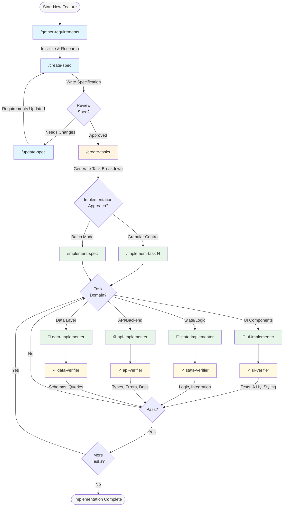

# devorch

**Composable AI workflow automation for Claude Code** - Build custom subagents, slash commands, and knowledge modules tailored to your codebase.

> **Built on [AgentOS](https://github.com/caspianai/agentos)** - Special thanks to [@CasJam](https://github.com/caspianai) for creating the foundation that makes devorch possible.

---

> **⚠️ PRE-ALPHA SOFTWARE**
>
> devorch is experimental and under active development. APIs are unstable, breaking changes are frequent. Not recommended for production environments.

---


---

## What is devorch?

devorch brings systematic AI automation to your development workflow. By installing specialized subagents, commands, and knowledge modules directly into your `.claude/` directory, you transform generic AI assistance into context-aware automation that understands your tech stack, follows your team's patterns, and enforces your coding standards.

### The devorch Platform

**[devor.ch](https://devor.ch)** - The devorch platform was built using this open-source CLI and offers autonomous AI agents that can independently build features and entire projects using this same technology. The platform provides:

- **Autonomous Development** - AI agents that build features end-to-end without manual intervention
- **Systematic Workflows** - Same methodology used in this CLI, scaled to cloud infrastructure
- **Team Collaboration** - Share agents, patterns, and workflows across your organization

**🚀 Get Started:** [https://devor.ch](https://devor.ch)
**🎛️ Console Access:** [https://devor.ch/console](https://devor.ch/console) (requires approved invite)
**💡 Methodology:** [BMAD Method](https://github.com/bmad-code-org/BMAD-METHOD) - Systematic AI-assisted development

---

## Getting Started

Choose your path:

- **👤 New to devorch?** Start with the [Quick Start Guide →](docs/user-guide/quickstart.md)
- **👨‍💻 Software engineer?** See [Developer's Guide →](docs/developer-guide/dev-guide.md) for workflows and patterns
- **🎨 Product designer?** Check [Designer's Guide →](docs/developer-guide/designers-guide.md) for design automation
- **🧠 Want the full picture?** Read [Core Concepts →](docs/user-guide/concepts.md) to understand the architecture

---

## Installation

### Requirements

- [GitHub CLI](https://cli.github.com/) ([authenticate first](https://cli.github.com/manual/gh_auth_login))
- [Anthropic API key](https://console.anthropic.com/)

**Non-technical users:** See the [Installation Guide](docs/user-guide/install.md) for step-by-step instructions with screenshots.

### Install CLI

```bash
gh api repos/guicheffer/devorch/contents/installer/setup.sh \
  --jq '.content' | base64 -d | sh
```

Add to your PATH:

```bash
export PATH="$PATH:$HOME/.local/bin"
```

Verify:

```bash
devorch --help
```

### Configure API Access

devorch uses Claude models via the Anthropic API. Set your environment:

```bash
export ANTHROPIC_API_KEY=your_api_key_here
export ANTHROPIC_MODEL=claude-sonnet-4-5-20250929-v1:0
```

**Available models:**
- `claude-sonnet-4-5-20250929-v1:0` (recommended)
- `claude-opus-4-5-20251101`
- `claude-3-5-sonnet-20241022`

Add to your shell profile (`~/.zshrc` or `~/.bashrc`) to persist.

See [Model Configuration](docs/user-guide/model-configuration.md) for details.

### Install in Project

Navigate to your project and run:

```bash
cd /path/to/your-project
devorch install
```

This will:
1. Create `devorch.config.yml` if missing
2. Guide you through interactive setup
3. Install commands, subagents, and skills to `.claude/`
4. Auto-create `.gitignore` files for generated content

**After cloning a project:** Just run `devorch install` to regenerate everything.

---

## Core Concepts

### Development Spectrum

devorch supports three development modes:

```
Vibe Coding ←──── Agentic Coding ←──── Spec-Driven Development
(Ad-hoc)          (Context-aware)       (Systematic)
```

**Vibe Coding** - Quick changes
Natural language: "Change button color to red"

**Agentic Coding** - Context-aware work
Load patterns: `/load-context-training` + freeform prompting

**Spec-Driven Development** - Planned features
Full workflow: `/gather-requirements` → `/create-spec` → `/implement-spec`

See [Workflows Guide](docs/user-guide/workflows.md) for detailed breakdown.

### Component Types

**Commands** - Slash commands (`/gather-requirements`, `/create-spec`)
User-initiated workflows for high-level tasks

**Subagents** - Specialized agents (`ui-implementer`, `spec-writer`)
Focused automation called by commands, each with narrow expertise

**Skills** - Knowledge modules (`zustand-patterns`, `zest-design-system`)
Repository-specific patterns extracted from your codebase (Claude Code only)

See [Core Concepts](docs/user-guide/concepts.md) for architecture details.

---

## Available Components

### Commands

#### Specification Workflow

| Command | Purpose |
|---------|---------|
| `/gather-requirements` | Research and plan new features |
| `/create-spec` | Transform requirements into implementation blueprint |
| `/update-spec` | Modify existing specification |
| `/create-tasks` | Break spec into actionable tasks |
| `/implement-task` | Implement individual tasks |
| `/implement-spec` | Batch implement all tasks |

#### Jira Integration

| Command | Purpose |
|---------|---------|
| `/jira-gather-requirements` | Fetch ticket and post questions |
| `/jira-create-spec` | Generate spec from ticket + answers |

#### Design Automation

| Command | Purpose |
|---------|---------|
| `/design-change-web` | Transform design files into styled components and layouts |
| `/verify-figma-file` | Validate design file structure and design system adherence |

#### Context Management

| Command | Purpose |
|---------|---------|
| `/analyze-tech-stack` | Document repository technologies |
| `/train-context` | Generate context training from codebase (includes verification) |
| `/update-context` | Update existing context training with new PRs |
| `/load-context-training` | Load patterns into conversation |

Both `/train-context` and `/update-context` automatically verify generated files for accuracy and code quality. Import paths, function signatures, and code examples are validated against your codebase. Critical issues are auto-fixed, quality issues are reported.

#### Utilities

| Command | Purpose |
|---------|---------|
| `/worktree` | Create git worktree with branch |
| `/panic` | Emergency context capture for debugging |

📖 **[Full Command Reference](docs/user-guide/command-reference.md)** with examples and troubleshooting

### Subagents

Specialized agents handle focused tasks to prevent context overload:

- **`specification/*`** - Create and verify specifications
- **`implementers/*`** - Implement UI, state, API, data layer changes
- **`verifiers/*`** - Run tests, check types, validate implementations
- **`researchers/*`** - Analyze patterns and extract conventions

Each agent sees only knowledge relevant to its specialty.

📖 **[Configuration Guide](docs/user-guide/configuration.md)** lists all available subagents

### Skills

Knowledge modules auto-generated from your codebase. Claude Code only.

**Popular skills:**
- `zustand-patterns` - State management
- `zest-design-system` - Design system usage
- `graphql-api` - GraphQL integration
- `navigation-patterns` - Routing and deep linking
- `test-patterns` - Testing conventions

📖 **[Skills System](docs/user-guide/skills.md)** for generation and usage

---

## Example Workflow

**Scenario:** Build user profile settings feature

### One-Time Setup

Analyze your tech stack:

```bash
/analyze-tech-stack
```

Output: `devorch/tech-stack.md`

Generate context training:

```bash
/train-context
```

Output: `devorch/context-training/` with custom implementers and patterns

Context-training files are automatically verified for accuracy and quality. Import paths and function signatures are validated against your codebase. Code examples are checked for best practices and security. Critical issues are auto-fixed, mismatches are reported for review.

### Feature Development

**1. Research phase**

```bash
/gather-requirements
```

Interactive session gathers requirements and constraints.

**2. Specification phase**

```bash
/create-spec
```

Generates `spec.md` and `tasks.md` following your patterns.

**3. Implementation phase**

```bash
/implement-spec
```

Routes tasks to specialized implementers:
- UI changes → `ui-implementer`
- State logic → `state-implementer`
- API calls → `api-implementer`
- Database → `data-implementer`

Each implementer references your context training and skills.

**4. Verification phase**

Automated verification checks:
- Tests pass
- Types valid
- Standards followed
- A11y compliant

---

## Workflow Diagram

Complete spec-driven development flow:



**Legend:**
- 🔵 Specification - Define requirements
- 🟡 Task Planning - Break into steps
- 🟢 Implementation - Domain-specific builders
- 🟡 Verification - Automated quality checks
- 🔄 Feedback Loop - Iterate until passing

---

## Configuration

Config files define installed components. devorch looks for:
1. `devorch.config.yml` (project root)
2. `devorch/config.yml` (alternate location)

### Basic Configuration

```yaml
profile:
  name: my-project
  agents: [claude-code]

commands:
  - name: /gather-requirements
    enabled: true
  - name: /create-spec
    enabled: true
  - name: /implement-spec
    enabled: true

# Dependencies (subagents, skills) auto-resolve from commands
```

### Advanced Configuration

**Important:** Place `context_training` in `devorch/config.local.yml` (gitignored), not main config.

```yaml
# devorch/config.local.yml
profile:
  name: my-project
  agents: [claude-code]
  context_training: mobile-app  # Developer-specific

commands:
  - name: /implement-spec
    enabled: true

# Manual subagent control (optional)
subagents:
  - name: specification/spec-writer
    enabled: true
  - name: implementers/ui-implementer
    enabled: true

# Manual skill control (Claude Code only)
skills:
  - name: zest-design-system
    enabled: true
  - name: zustand-patterns
    enabled: false
```

**Context training effects:**
- Merges custom implementers from `devorch/context-training/mobile-app/implementers/*.md`
- Appends specification guidelines to spec writers
- Guides task assignment with `implementation.md`

📖 **[Configuration Guide](docs/user-guide/configuration.md)** for complete reference

---

## Version Control

devorch automatically creates `.gitignore` files during installation:

```
.claude/agents/devorch/.gitignore      # Generated subagents
.claude/commands/devorch/.gitignore    # Generated commands
.claude/skills/.gitignore              # Bundled skills
devorch/.gitignore                     # State directory
```

**Gitignored:**
- ✅ Generated subagents and commands
- ✅ Enabled bundled skills
- ✅ Installation state

**Not gitignored:**
- ❌ Custom skills (user-created)
- ❌ Config file (team settings)

**Why?** Generated files are reproducible via `devorch install`. Each developer can customize their setup without conflicts.

---

## Keeping Updated

devorch tracks versions in `devorch/.state/state.json`. Commands notify you when updates are available.

```bash
# Update CLI and templates
devorch update
```

New installations automatically use the latest version.

📖 **[Updating Guide](docs/user-guide/quickstart.md#updating-devorch)** for details

---

## Documentation Hub

### User Guides

- **[Quick Start](docs/user-guide/quickstart.md)** - Installation and first project
- **[Command Reference](docs/user-guide/command-reference.md)** - Complete command guide
- **[Workflows](docs/user-guide/workflows.md)** - When to use which approach
- **[Configuration](docs/user-guide/configuration.md)** - Config file reference
- **[Core Concepts](docs/user-guide/concepts.md)** - Architecture and design
- **[Model Configuration](docs/user-guide/model-configuration.md)** - API setup
- **[Context Training](docs/user-guide/context-training.md)** - Customize for your repo
- **[Skills System](docs/user-guide/skills.md)** - Knowledge modules (Claude Code)
- **[Polyrepo Setup](docs/user-guide/polyrepo.md)** - Multi-repo coordination

### Developer Guides

- **[Developer's Guide](docs/developer-guide/dev-guide.md)** - Workflows and best practices
- **[Designer's Guide](docs/developer-guide/designers-guide.md)** - Design to implementation workflows
- **[Extending](docs/developer-guide/extending.md)** - Build custom components
- **[Template Creation](templates/CONTRIBUTING.md)** - Detailed template guide
- **[Local Development](docs/developer-guide/development.md)** - Contributing to devorch
- **[Contributing as User](docs/developer-guide/contributing-as-user.md)** - Report issues effectively

---

## Troubleshooting

When commands fail or get stuck:

1. **Ask Claude why** - "Why did you get stuck?"
2. **Understand the root cause** - Work with Claude to diagnose
3. **Share improvements** - Create a [GitHub issue](https://github.com/guicheffer/devorch/issues)

Your feedback helps improve devorch for everyone.

### Useful Commands

```bash
devorch --help            # Show available commands
devorch diagnose          # Check installation health
devorch count-tokens      # Analyze template token usage
devorch check-version     # Check for updates
```

📖 **[Contributing as User](docs/developer-guide/contributing-as-user.md)** for debugging workflow

---

## Privacy & Telemetry

devorch collects anonymous usage data to improve the tool. Uses Sentry for error tracking.

**Collected:**
- ✅ Command usage and duration
- ✅ CLI version and platform
- ✅ Computer ID (system username)
- ✅ Error messages and stack traces

**Not collected:**
- ❌ File paths or directory names
- ❌ Command arguments
- ❌ Environment variables
- ❌ Project-specific data
- ❌ Sensitive information

**Note:** Automatically disabled in CI environments.

---

## About devorch

devorch is an open-source CLI tool that extends [AgentOS](https://github.com/caspianai/agentos) to deliver composable AI workflow automation for Claude Code. Built on the foundation created by [@CasJam](https://github.com/caspianai), devorch adds specialized workflows, knowledge systems, and automation patterns specifically designed for modern development teams.

### Philosophy

devorch follows the [BMAD Method](https://github.com/bmad-code-org/BMAD-METHOD) principles for systematic AI-assisted development:

**Phased Development**
Research → Specification → Implementation → Verification

**Specialized Agents**
Domain-specific automation prevents context overload and improves quality

**Knowledge Preservation**
Extract patterns from your codebase to maintain consistency across the team

**Automated Verification**
Built-in quality checks ensure standards compliance before code review

### Project Links

**Platform:**
- [devorch Website](https://devor.ch) - Autonomous AI agents for building features and projects
- [Console](https://devor.ch/console) - Platform access (requires approved invite)

**Open Source:**
- [GitHub Repository](https://github.com/guicheffer/devorch) - Source code and issue tracking
- [Documentation](docs/index.md) - Complete CLI reference and guides
- [Create an Issue](https://github.com/guicheffer/devorch/issues) - Bug reports and feature requests

**Foundation:**
- [AgentOS](https://github.com/caspianai/agentos) - The extensible agent framework powering devorch
- [BMAD Method](https://github.com/bmad-code-org/BMAD-METHOD) - Methodology and best practices

---

**Systematic AI automation for development teams.**
