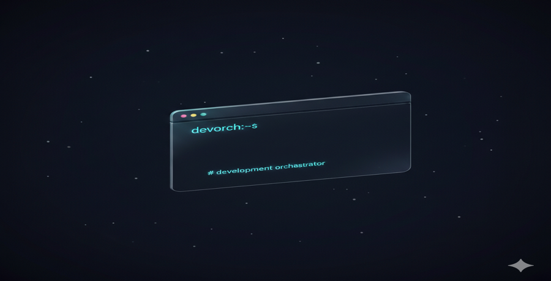

# DevOrch

> **⚠️ PRE-ALPHA WARNING**
>
> DevOrch is currently in pre-alpha development and **not ready for production use**. Features are experimental, APIs may change without notice, and breaking changes are expected. Use at your own risk.
>
---

**DevOrch is a CLI tool for composable AI workflow automation** - Install custom subagents and slash commands for Claude Code.

Configure exactly which AI agents and commands you need for your project.

**🌐 Learn more:** [https://devor.ch/](https://devor.ch/) (coming soon)

**💡 Based on:** [BMAD Method](https://github.com/bmad-code-org/BMAD-METHOD) - A systematic approach to AI-assisted development

---



---

**✨ New to devorch?** Start here: **[Quick Start →](docs/user-guide/quickstart.md)**

**🎥 Want to see it in action?** Watch: **[Video Tutorial ↓](#-video-tutorial)**

**📖 Looking for commands?** See: **[Command Reference →](docs/user-guide/command-reference.md)**

**👨‍💻 Are you a developer?** See: **[Developer's Guide →](docs/developer-guide/dev-guide.md)**

**🎨 Are you a designer?** See: **[Designer's Guide →](docs/developer-guide/designers-guide.md)**

**🧠 Want to understand how it works?** Read: **[Core Concepts →](docs/user-guide/concepts.md)**

---

## 📚 Documentation

### Getting Started
- **[Quick Start](docs/user-guide/quickstart.md)** - Install CLI and set up your first project (5 minutes)
- **[Model Configuration](docs/user-guide/model-configuration.md)** - Configure Anthropic API models
- **[Command Reference](docs/user-guide/command-reference.md)** - Complete command guide with examples and troubleshooting
- **[Developer's Guide](docs/developer-guide/dev-guide.md)** - For developers: workflows, commands, and best practices
- **[Designer's Guide](docs/developer-guide/designers-guide.md)** - For designers: turn Figma into code without coding
- **[Core Concepts](docs/user-guide/concepts.md)** - Understand the architecture and components
- **[Configuration Guide](docs/user-guide/configuration.md)** - Complete `devorch.config.yml` reference
- **[Workflows](docs/user-guide/workflows.md)** - When and how to use commands

### Features
- **[Context Training System](docs/user-guide/context-training.md)** - Customize devorch for your repository
- **[Skills System](docs/user-guide/skills.md)** - Knowledge modules from real codebases (Claude Code only)

### Advanced
- **[Extending](docs/developer-guide/extending.md)** - Creating custom commands, subagents, and skills
- **[Template Creation](templates/CONTRIBUTING.md)** - Detailed guide for creating commands, subagents, and skills
- **[Local Development](docs/developer-guide/development.md)** - Contributing to devorch

---

## 🚀 Quick Start

### 1. Install the CLI

**For non-technical users (PMs, UX designers):**

See the [Installation Guide](docs/user-guide/install.md) for step-by-step instructions with screenshots. You'll download a zip file, run a simple script, and you're done!

**For developers:**

Requires [GitHub CLI](https://cli.github.com/). [Authenticate first](https://cli.github.com/manual/gh_auth_login) if needed.

```bash
gh api repos/guicheffer/devorch/contents/installer/setup.sh \
  --jq '.content' | base64 -d | sh
```

**Add to PATH:**
```bash
export PATH="$PATH:$HOME/.local/bin"
```

**Verify installation:**
```bash
devorch --help
```

Available commands: `install`, `diagnose`, `count-tokens`, `update`, `check-version`

### 2. Configure Anthropic API

DevOrch uses Claude models directly via the Anthropic API. Configure your environment:

```bash
export ANTHROPIC_API_KEY=your_api_key_here
export ANTHROPIC_MODEL=claude-sonnet-4-5-20250929-v1:0
```

**Available models:**
- `claude-sonnet-4-5-20250929-v1:0` (recommended)
- `claude-opus-4-5-20251101`
- `claude-3-5-sonnet-20241022`

Add these to your shell profile (~/.zshrc or ~/.bashrc) to persist across sessions.

### 3. Install in Your Project

```bash
cd /path/to/your-project
devorch install
```

This command:
1. Creates config if missing
2. Guides you through interactive setup
3. Installs all available commands
4. Auto-resolves dependencies (subagents and skills)
5. Components installed to `.claude/`

### 3. Automatic .gitignore (No Action Required)

**devorch automatically creates `.gitignore` files during installation** to keep generated files out of version control:

```
# Auto-created by installer
.claude/agents/devorch/.gitignore      # Ignores all generated subagents
.claude/commands/devorch/.gitignore    # Ignores all generated commands
.claude/skills/.gitignore                   # Ignores enabled bundled skills only
devorch/.gitignore                     # Ignores .state/ directory
```

**What gets auto-gitignored:**
- ✅ Generated subagents and commands (always gitignored)
- ✅ Enabled bundled skills (gitignored, can be regenerated)
- ✅ Installation state (gitignored)
- ❌ Custom skills (not gitignored - user-created content)
- ❌ Config file (not gitignored - team settings)

**Why automatic?**
- Generated files can be recreated with `devorch install`
- Each developer can customize their setup without conflicts
- Keeps your repo clean and focused on source code

**After cloning:** Just run `devorch install` to regenerate everything.

### 4. Update Configuration

```bash
# Edit config
vim devorch.config.yml

# Reinstall with new config
devorch install
```

### 5. Keep devorch Updated

**devorch automatically uses the latest version.** The installed version is tracked in `devorch/.state/state.json`, and commands will prompt you to update when new versions are available.

```bash
# Update CLI and install updated templates
devorch update
```

**How it works:**
- Version is tracked in `.state/state.json`, not in your config
- New installations automatically use latest
- Commands notify you when updates are available (both CLI and templates)
- Running `devorch update` automatically updates the CLI and installs updated templates

See [Updating devorch](docs/user-guide/quickstart.md#updating-devorch) for details.

### 6. Got Stuck? You Can Help!

If a command fails or gets stuck:
1. **Ask Claude why** - "Why did you get stuck?" or "Why did you include this file?"
2. **Understand the issue** - Work with Claude to diagnose root cause
3. **Share improvements** - Create a GitHub issue

See **[Contributing as User](docs/developer-guide/contributing-as-user.md)** for complete debugging workflow.

Your struggles are valuable feedback that helps improve devorch for everyone! 🚀

---

## 📦 Available Components

### Commands

Slash commands for AI-driven workflows:

#### Context & Planning
| Command | Purpose | When to Use |
|---------|---------|-------------|
| `/analyze-tech-stack` | Document repository tech stack | Before context training (one-time setup) |
| `/train-context` | Generate context training from codebase | After tech stack analysis (one-time setup) |
| `/load-context-training` | Load context training files into conversation | Reference patterns, debug context training |

#### Specification Workflow
| Command | Purpose | When to Use |
|---------|---------|-------------|
| `/gather-requirements` | Research and plan new feature | Starting new feature/epic |
| `/create-spec` | Transform requirements into blueprint | After research is complete |
| `/update-spec` | Update existing spec with changed requirements | Before tasks created - pre-implementation iteration |
| `/create-tasks` | Break down spec into tasks | After spec is written |
| `/implement-task` | Implement specific tasks | Granular control over implementation |
| `/implement-spec` | Batch implement all tasks | Ready for full implementation |
| `/jira-gather-requirements` | Fetch Jira ticket and post clarifying questions | Starting from Jira ticket (alternative workflow) |
| `/jira-create-spec` | Generate spec from Jira ticket + answers | After questions answered in Jira (alternative workflow) |

#### Design & UX
| Command | Purpose | When to Use |
|---------|---------|-------------|
| `/design-change-web` | Implement visual/styling changes from Figma (colors, spacing, layout) | Design handoff for web apps (styling only - no interactivity/state/API changes) |
| `/verify-figma-file` | Audit Figma files for design system compliance | Design review and validation |

#### Utilities
| Command | Purpose | When to Use |
|---------|---------|-------------|
| `/worktree` | Create git worktree with branch | Working on multiple features |
| `/panic` | Debug context collection | Something is broken |

See **[Command Reference](docs/user-guide/command-reference.md)** for complete details.

### Subagents

Specialized agents for focused tasks:

**Categories:**
- **`specification/*`** - Create and verify specifications
- **`implementers/*`** - Implement changes (UI, data access, state, etc.)
- **`verifiers/*`** - Verify implementations with automation
- **`researchers/*`** - Research patterns and conventions

**Why multiple agents?** Prevents context overload. Each agent sees only relevant knowledge for their specialty.

See **[Configuration Guide](docs/user-guide/configuration.md)** for available subagents.

### Skills

**Knowledge modules extracted from real codebases. Claude Code only.**

Skills are auto-generated by analyzing your repository code, extracting patterns, best practices, and conventions.

**Available skills:**
- `zustand-patterns` - State management patterns
- `zest-design-system` - Design system usage
- `graphql-api` - GraphQL integration patterns
- `navigation-patterns` - Routing and deep linking
- `test-patterns` - Testing conventions
- And many more...

See **[Skills System](docs/user-guide/skills.md)** for complete details.

---

## ⚙️ Configuration

Your config file defines what gets installed. devorch looks for config in:
1. `devorch.config.yml` in project root (primary)
2. `devorch/config.yml` (secondary - keeps all devorch files together)

**Quick example:**
```yaml
profile:
  name: my-project
  agents: [claude-code]

commands:
  - name: /gather-requirements
    enabled: true
  - name: /create-spec
    enabled: true
  - name: /create-tasks
    enabled: true
  - name: /implement-spec
    enabled: true
  - name: /worktree
    enabled: true
  - name: /panic
    enabled: true

# Subagents and skills are auto-resolved from command dependencies
```

**Advanced example with context training:**

> **Important:** The `context_training` field must be placed in `devorch/config.local.yml` (not versioned), not in the main config file. Context training is developer-specific and should not be committed to the repository. This prevents merge conflicts and avoids accidentally committing personal configurations.

```yaml
# devorch/config.local.yml
profile:
  name: my-project
  agents: [claude-code]
  context_training: mobile-app  # Developer-specific context

commands:
  - name: /implement-spec
    enabled: true

# Manually specify subagents (or let dependencies auto-resolve)
subagents:
  - name: specification/spec-writer
    enabled: true
  - name: implementers/ui-implementer
    enabled: true

# Manually specify skills (Claude Code only)
skills:
  - name: zest-design-system
    enabled: true
  - name: zustand-patterns
    enabled: false  # Available but not enabled
```

**With context training:**
- Custom implementers merged from `devorch/context-training/mobile-app/implementers/*.md`
- Specification guidelines from `specification.md` appended to spec writers
- Implementation guide from `implementation.md` helps with task assignment

See [Configuration Guide](docs/user-guide/configuration.md) for complete reference.

---

## 🔄 Development Spectrum

Choose the right tool for the task:

```
Vibe Coding ←─── Agentic Coding ←─── Spec-Driven Development
(Quick)          (Tagged)            (Planned)
```

**Vibe Coding** - Quick, ad-hoc changes
- Example: "Change button color to red"
- Tools: Direct AI assistance in IDE

**Agentic Coding** - Targeted, context-aware work
- Example: `/load-context-training` then freeform prompting with domain context
- Tools: Load context training files, then natural language requests
- Benefit: Right standards without context overload

**Spec-Driven Development** - Comprehensive, planned work
- Example: User engagement feature across frontend and backend
- Tools: DevOrch CLI with workflows
- Benefit: Consistent implementation and verification across workspace

See [Workflows](docs/user-guide/workflows.md) for detailed guide.

---

## 🎯 Example Workflow

**Scenario:** Build a new user profile settings feature

### 0. Setup (One-Time)

**Analyze your tech stack:**
```bash
/analyze-tech-stack
```

**Output:** `devorch/tech-stack.md` documenting your platform, libraries, and available skills

**Create repository-specific context training:**
```bash
/train-context
```

**Output:**
- `devorch/context-training/my-app/` with domain customizations
- Config updated with context-training reference and detected skills
- Merged implementers installed (ui-implementer, state-implementer, etc.)

### 1. Research (`/gather-requirements`)

```
/gather-requirements

> What feature are you building?
User profile settings page

> What's the main user goal?
Allow users to update preferences...

... (interactive research)
```

**Output:** Research folder with requirements and assets

### 2. Create Blueprint (`/create-spec`)

```
/create-spec
```

**Output:**
- `spec.md` - Detailed specification (follows your context training's specification guidelines)
- `tasks.md` - Breakdown by specialty (uses your custom implementers)

### 3. Implement (`/implement-spec`)

```
/implement-spec
```

**What happens:**
- Discovers your custom implementers (ui-implementer, state-implementer, etc.)
- Selects appropriate implementer based on task
- Implementer follows your domain preferences from context training
- References skills mentioned in context training (**zustand-patterns**, **ui-design-system/zest**)
- Verifier checks work using your verification rules

**Output:** Implementation docs and verification report

---

## 🗺️ Complete Workflow Diagram

The following diagram shows the complete spec-driven development workflow with all phases and agent interactions:


**Legend:**
- 🔵 **Specification Phase** - Define what to build
- 🟡 **Task Planning** - Break down into actionable tasks
- 🟢 **Implementation Phase** - Domain-specific implementers (UI, State, API, Data)
- 🟡 **Verification Phase** - Automated verification (tests, types, standards)
- 🔄 **Feedback Loop** - Failed verification triggers fixes

---

## 🛠️ Creating Custom Assets

Create custom commands, subagents, and skills by editing markdown files:

```bash
mkdir -p templates/commands/my-command/single-agent
vim templates/commands/my-command/single-agent/my-command.md
```

See [Extending Guide](docs/developer-guide/extending.md) and [Template Creation Guide](templates/CONTRIBUTING.md) for detailed instructions on:
- Creating custom commands
- Building subagents
- Developing skills
- Contributing to devorch

---

## 📖 Additional Resources

### Documentation
- [Configuration Guide](docs/user-guide/configuration.md) - Complete config reference
- [Workflows](docs/user-guide/workflows.md) - When and how to use commands
- [Skills System](docs/user-guide/skills.md) - Knowledge modules (Claude Code)

### Advanced Topics

- [Extending](docs/developer-guide/extending.md) - Creating custom components
- [Development](docs/developer-guide/development.md) - Contributing to devorch codebase
- [Polyrepo Setup](docs/user-guide/polyrepo.md) - Multi-repo coordination (alternate setup)

### Community
- [Contributing as User](docs/developer-guide/contributing-as-user.md) - When you get stuck and how to help improve devorch

### Troubleshooting
- Check CLI help: `devorch --help`
- Check installation health: `devorch diagnose`
- **Got stuck?** See [Contributing as User](docs/developer-guide/contributing-as-user.md) for debugging help

### Privacy & Telemetry

**devorch collects anonymous usage data** to help improve the tool. This telemetry is privacy-focused and uses Sentry for error tracking.

**What we collect:**
- ✅ Command usage (which commands you run)
- ✅ Command duration and success/failure
- ✅ CLI version and platform (OS, Node version)
- ✅ Computer ID (system username for user identification)
- ✅ Error messages and stack traces (when commands fail)

**What we DON'T collect:**
- ❌ File paths or directory names
- ❌ Command arguments or parameters
- ❌ Environment variables
- ❌ Project-specific data
- ❌ Sensitive personal information

**Note:** Telemetry is automatically disabled in CI environments.

---

## 🌐 About DevOrch

**DevOrch is currently a CLI tool.** The web application at [https://devor.ch/](https://devor.ch/) is planned for future development and will serve as a reference and documentation hub for the open-source CLI.

### Inspiration

DevOrch is based on the [BMAD Method](https://github.com/bmad-code-org/BMAD-METHOD) - a systematic approach to AI-assisted software development that emphasizes:
- Breaking down complex work into manageable phases (research, specification, implementation, verification)
- Using specialized agents for different types of tasks
- Maintaining context through documentation and structured workflows
- Automated verification to ensure quality

---

**Links:**
- [DevOrch Website](https://devor.ch/) (coming soon)
- [This Repository](https://github.com/guicheffer/devorch)
- [BMAD Method](https://github.com/bmad-code-org/BMAD-METHOD)

**Issues & Feedback:**
- [Create an issue](https://github.com/guicheffer/devorch/issues) on GitHub
