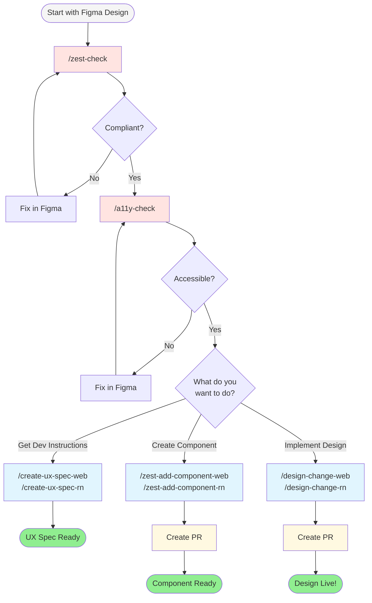

# Designer's Guide to Claude Code


Welcome! This guide shows you how to use Claude Code to turn your Figma designs into working code—no coding experience needed.

## What is Claude Code?

Think of Claude Code as your personal coding assistant. You describe what you want (or share your Figma designs), and it writes the code for you. It can:
- Turn Figma designs into real components
- Implement design changes in web and React Native apps
- Check if your designs follow design system rules
- Generate detailed development specs from your designs
- Create pull requests for developers to review

## Getting Started

### Prerequisites

Before you start, you'll need:

1. **GitHub CLI (`gh`)** - Required for all commands
   - Install: https://cli.github.com/
   - After installing, run: `gh auth login` to authenticate

2. **AWS Bedrock Access** - Required for Claude Code to work
   - Run: `devorch setup-bedrock` (this guided wizard will install everything)
   - If you have issues, run: `devorch debug-bedrock`
   - See [AWS Bedrock Setup Guide](../user-guide/aws-bedrock-setup.md) for detailed instructions

3. **Figma MCP Server** - Required to read Figma designs
   - This lets Claude Code access your Figma designs
   - **Installation steps**:
     1. Open your terminal
     2. Run: `claude mcp add --transport http figma https://mcp.figma.com/mcp`
     3. In Claude Code, type `/mcp` and select **figma**
     4. Select **Authenticate** and click **Allow Access**
     5. You should see: "Authentication successful. Connected to figma"
   - Full guide: https://developers.figma.com/docs/figma-mcp-server/remote-server-installation/#claude-code

4. **Figma File Access** - Important guidelines
   - Make sure you can access the Figma files you want to work with
   - **Always select a specific frame** (not the entire file!)
   - Copy the link with the frame selected: it should look like `https://www.figma.com/design/xyz?node-id=1-456`
   - The link must include `node-id` - this tells Claude which part of the design to read

5. **Optional (but helpful)**:
   - `node` and `yarn` - Lets you preview changes locally
   - Chrome DevTools MCP - Lets Claude Code check web changes automatically
   - Mobile MCP - Lets Claude Code verify React Native changes on simulators

---

## When to Use What

Here's the recommended workflow for turning your designs into code:

### For Web Projects

1. **Start with `/zest-check`** - Check if your Figma design follows Zest design system rules
   - This tells you if any components are missing from Zest
   - Shows what needs to be fixed in Figma or added to the design system

2. **Want dev instructions? `/create-ux-spec-web`** - Generate detailed implementation specs
   - Creates a document mapping all Figma tokens to Zest tokens
   - Lists all components with their exact props and code snippets
   - Great for handoff to developers or before implementing yourself

3. **If components are missing: `/zest-add-component-web`** - Create the missing Zest component
   - Add any new components that don't exist in Zest yet
   - Wait for the PR to be merged before moving to the next step

4. **Once components exist: `/design-change-web`** - Implement your design in the web app
   - Use the Zest components (now that they exist!) to build your design
   - Make design changes to existing pages or features

### For React Native Projects

1. **Start with `/zest-check`** - Same command, checks both web AND React Native
   - Shows platform-specific scores and discrepancies
   - Highlights components available in one platform but not the other

2. **Want dev instructions? `/create-ux-spec-rn`** - Generate React Native implementation specs
   - Maps Figma tokens to Zest RN tokens (global.* and alias.*)
   - Includes useZestStyles patterns and code snippets
   - Covers responsive design and image handling

3. **Implement changes: `/design-change-rn`** - Implement your design in React Native
   - Works in the shared-mobile-modules repository
   - Uses Mobile MCP to verify changes on simulators

**The flow**: Check → Get Specs → Add missing components → Implement

---

## Design Commands

Claude Code has several commands for designers:

### Verification Commands

#### `/zest-check` - Check Your Design

**When to use**: Before implementing anything, check if your Figma design follows the Zest design system rules.

**What it does**:
- Scans your Figma file for colors, spacing, typography, etc.
- Compares them against Zest design tokens for BOTH platforms
- Gives you implementability scores for web and React Native
- Highlights platform discrepancies

**How to use**:
```
/zest-check
```

Claude will ask you for:
- Your Figma file link (make sure to select a specific frame!)

**Example output**:
```
Zest Implementability Check Complete

| Platform       | Score | Status                    |
|----------------|-------|---------------------------|
| Web            | 9/10  | Fully implementable       |
| React Native   | 7/10  | Minor custom styling needed |

Platform Discrepancies:
- Gradient backgrounds: Available in web, needs custom implementation in RN
```

---

#### `/a11y-check` - Check Accessibility

**When to use**: To audit your Figma design for accessibility compliance.

**What it does**:
- Checks color contrast ratios
- Verifies touch target sizes
- Reviews text readability
- Identifies accessibility issues

**How to use**:
```
/a11y-check
```

---

### Spec Generation Commands

#### `/create-ux-spec-web` - Generate Web Dev Instructions

**When to use**: When you want detailed development instructions for implementing a Figma design on web.

**What it does**:
- Extracts all design tokens from your Figma file
- Maps them to Zest web tokens
- Lists all components with exact props
- Provides code snippets
- Saves a markdown spec document

**How to use**:
```
/create-ux-spec-web
```

**What you'll get**:
A markdown document with:
- Token mapping table (Figma → Zest)
- Component breakdown with code examples
- Layout structure (Box hierarchy)
- Responsive considerations

---

#### `/create-ux-spec-rn` - Generate React Native Dev Instructions

**When to use**: When you want detailed development instructions for implementing a Figma design in React Native.

**What it does**:
- Extracts all design tokens from your Figma file
- Maps them to Zest RN tokens (global.* and alias.*)
- Lists all components with exact props
- Provides useZestStyles code patterns
- Includes responsive design considerations

**How to use**:
```
/create-ux-spec-rn
```

**What you'll get**:
A markdown document with:
- Token mapping (Figma → global.spacing.*, alias.color.*, etc.)
- Component breakdown with Zest RN components
- useZestStyles patterns with createStylesConfig
- Image handling with ImageCloudinary
- Accessibility requirements (testID, altText)

---

### Implementation Commands

#### `/zest-add-component-web` - Create or Update Web Components

**When to use**: When you need to add a new Zest component (like Badge, Banner, etc.) or update an existing one.

**What it does**:
- Reads your Figma design
- Creates all the files needed for a component
- Writes tests automatically
- Creates Storybook documentation
- Makes a pull request for review

**How to use**:
```
/zest-add-component-web
```

Claude will ask you:
1. **Are you adding NEW or UPDATING existing?**
2. **Figma design link** (specific frame!)
3. **Component name** (like "Badge" or "ProgressBar")
4. **Brief description** (1-2 sentences)
5. **JIRA ticket number** (for the PR)

---

#### `/design-change-web` - Implement Web Design Changes

**When to use**: When you need to update visual design in an existing web app (colors, spacing, typography, layout).

**⚠️ Important Limitations**:
This command is **only for visual/styling changes**. It does NOT support:
- ❌ Adding interactivity (click handlers, form submissions, etc.)
- ❌ Changing component state or logic
- ❌ Adding or modifying API calls
- ✅ Updating colors, spacing, typography
- ✅ Changing layout and positioning
- ✅ Updating existing component styles

**How to use**:
```
/design-change-web
```

Claude will ask you:
1. **Figma design link**
2. **What changed?** (colors, spacing, layout, etc.)
3. **Where in the app?** (homepage, checkout, etc.)
4. **JIRA ticket number**

---

#### `/design-change-rn` - Implement React Native Design Changes

**When to use**: When you need to update visual design in a React Native module (shared-mobile-modules).

**⚠️ Important Limitations**:
Same as web - **only for visual/styling changes**.

**What it does**:
- Reads your Figma design
- Finds the right module and component
- Makes visual changes using Zest RN tokens
- Can verify changes using Mobile MCP on simulators
- Creates a pull request

**How to use**:
```
/design-change-rn
```

Claude will ask you:
1. **Figma design link**
2. **What changed?**
3. **Which module and screen?** (e.g., "onboarding module, welcome screen")
4. **JIRA ticket number**

---

### JIRA Integration Commands

All verification commands have JIRA-integrated versions that automatically post results to tickets:

| Command | JIRA Version |
|---------|--------------|
| `/zest-check` | `/jira-zest-check [TICKET-KEY]` |
| `/a11y-check` | `/jira-a11y-check [TICKET-KEY]` |

---

## Typical Workflows

### Creating a New Web Component

```
Step 1: /zest-check
        ↓ (fix any issues in Figma)
Step 2: /create-ux-spec-web (optional - get dev instructions)
        ↓
Step 3: /zest-add-component-web
        ↓ (answer questions, review plan)
Step 4: Wait for PR approval
        ↓
Step 5: Done! Component is ready to use
```

### Implementing Web Design Changes

```
Step 1: /zest-check (verify design compliance)
        ↓
Step 2: /create-ux-spec-web (optional - understand implementation)
        ↓
Step 3: /design-change-web
        ↓ (answer questions about location)
Step 4: Wait for PR approval
        ↓
Step 5: Done! Design is live
```

### Implementing React Native Design Changes

```
Step 1: /zest-check (check both platforms)
        ↓
Step 2: /create-ux-spec-rn (optional - get RN-specific instructions)
        ↓
Step 3: /design-change-rn
        ↓ (specify module and screen)
Step 4: Wait for PR approval
        ↓
Step 5: Done! Design is live
```

---

## Common Questions

**Q: Do I need to know how to code?**
No! Claude Code writes all the code for you. You just need to describe what you want.

**Q: How do I install the Figma MCP?**
Run this command in your terminal: `claude mcp add --transport http figma https://mcp.figma.com/mcp`
Then type `/mcp` in Claude Code, select **figma**, click **Authenticate**, and allow access.

**Q: What's the difference between `/zest-check` and `/create-ux-spec-*`?**
- `/zest-check` tells you IF your design is implementable (scoring/audit)
- `/create-ux-spec-*` tells you HOW to implement it (detailed dev instructions)

**Q: What if I make a mistake?**
Don't worry! Everything goes through a pull request, so developers review your changes before they go live.

**Q: Can I preview my changes?**
- **Web**: If you have `node` and `yarn`, Claude can run a local preview
- **React Native**: If you have Mobile MCP, Claude can verify on simulators

**Q: What's a "frame" in Figma?**
A frame is a specific section of your Figma design. Always select the frame you want to work with, not the entire file. The link should include `node-id`.

**Q: What if something goes wrong?**
Use the `/panic` command to collect debug info and create a GitHub issue.

---

## Tips for Success

1. **Be specific**: The more details you give, the better Claude understands
2. **Select frames, not files**: Always select a specific frame in Figma
3. **Review the plan**: Claude will show you what it's going to do—review it carefully
4. **Ask questions**: If you're unsure, ask Claude to explain
5. **One thing at a time**: Don't try to do too many changes in one command
6. **Check compliance first**: Use `/zest-check` before implementing

---

## Need Help?

- **For command help**: Run `/help` in Claude Code
- **AWS/Login issues**: Run `devorch debug-bedrock` - see [AWS Bedrock Setup Guide](../user-guide/aws-bedrock-setup.md)
- **Questions/Feedback**: Ask in **#ai-native-pdlc** on Slack

---

## Visual Workflow Guide



**Commands by platform:**
| Goal | Web | React Native |
|------|-----|--------------|
| Check design tokens | `/zest-check` | `/zest-check` |
| Check accessibility | `/a11y-check` | `/a11y-check` |
| Get dev instructions | `/create-ux-spec-web` | `/create-ux-spec-rn` |
| Create component | `/zest-add-component-web` | `/zest-add-component-rn` |
| Implement design | `/design-change-web` | `/design-change-rn` |
