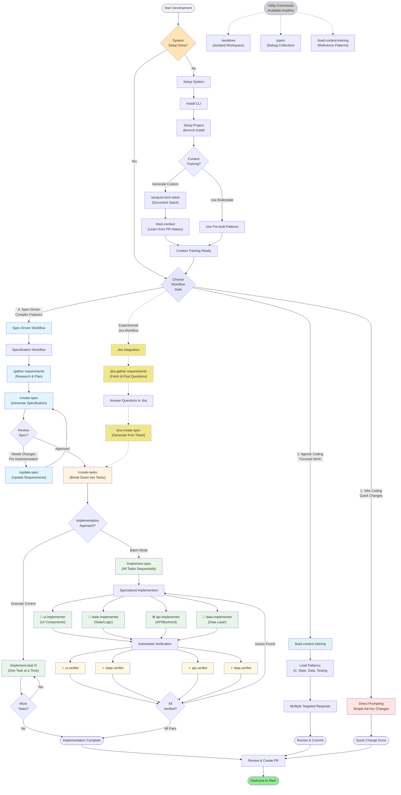

# Developer's Guide to DevOrch


A practical guide to using DevOrch with Claude Code for AI-powered development workflows.

## Quick Start

### Installation

1. **Install CLI**:
   ```bash
   gh api repos/guicheffer/devorch/contents/installer/setup.sh \
     --jq '.content' | base64 -d | sh
   export PATH="$PATH:$HOME/.local/bin"
   ```

2. **Setup AWS Bedrock** (if not already configured):
   ```bash
   devorch setup-bedrock
   ```
   See [AWS Bedrock Setup Guide](../user-guide/aws-bedrock-setup.md) for details and troubleshooting.

3. **Setup project**:
   ```bash
   cd /path/to/your-project
   devorch install
   ```

3. **Choose context training** (during install):
   - **Use a boilerplate** - Quick start with pre-built patterns
   - **Generate custom** (recommended) - Learn from your PR history

See [Quick Start Guide](../user-guide/quickstart.md) for detailed installation.

---

## Three Development Styles

Choose based on task complexity:

### 1. Vibe Coding - Quick Changes
**When**: Simple, ad-hoc changes
**How**: Direct prompting, no commands needed

```
You: Change the login button color to brand-primary
Claude: [Makes the change]
```

### 2. Agentic Coding - Focused Work
**When**: Targeted work in one domain (UI, state, data, etc.)
**How**: Load context once, make multiple requests

```
You: /load-context-training

Claude: ✅ Context training loaded
- UI patterns
- State management patterns
- Data access patterns
- Testing patterns

You: Update the login form styling to match the design system
You: Add form validation
You: Add accessibility features
```

**Benefits**: Gets your patterns without context overload, faster than full workflow

### 3. Spec-Driven - Complex Features
**When**: Multi-component work, coordinated changes
**How**: Research → Spec → Tasks → Implement

```
/gather-requirements → /create-spec → /create-tasks → /implement-spec
```

**Benefits**: Consistent implementation, built-in verification, documentation trail

---

## Key Commands

### Setup (One-Time)

#### `/analyze-tech-stack` - Document Your Stack
Analyzes dependencies and creates `tech-stack.md`. Run once per project.

#### `/train-context` - Learn Your Patterns
Generates custom context training from your codebase:
- Extracts patterns from merged PRs
- Creates domain-specific guidelines (UI, state, data, testing)
- Activates relevant skills

**Alternative**: During first install, choose a boilerplate for quick setup.

#### `/load-context-training` - Load Patterns
Loads all context training into conversation. Use this before making changes to get your team's patterns automatically.

---

### Specification Workflow

For complex features, use the full workflow:

#### 1. `/gather-requirements` - Research
Interactive research phase:
- Clarifying questions
- Similar pattern discovery
- Visual assets collection
- Requirements documentation

Creates: `specs/YYYY-MM-DD-feature-name/planning/`

#### 2. `/create-spec` - Write Spec
Generates detailed specification:
- Overview and requirements
- Technical approach
- Component breakdown
- Tasks organized by domain

Creates: `spec.md` and `tasks.md`

#### 2b. `/update-spec` - Update Existing Spec (Pre-Implementation)
Updates an existing specification with changed requirements:
- Displays current spec summary
- Collects change requests (ADD, MODIFY, REMOVE, CLARIFY)
- Updates requirements.md in-place
- Regenerates spec.md and verification

**Use BEFORE creating tasks** - For iterating on requirements during planning phase.
**Warns if tasks.md exists** - Implementation may have started.

#### 3. `/create-tasks` - Break Down
Converts spec into actionable tasks grouped by domain (UI, State, Data Access, Testing).

#### 4. `/implement-task N` or `/implement-spec`
**Granular**: `/implement-task 1` - Implement one task at a time
**Batch**: `/implement-spec` - Implement all tasks automatically

Both include verification and error fixing.

---

### Alternative: Jira Workflow (Experimental)

> **⚠️ Early Stage**: Jira commands are currently for testing and experimentation. Full Jira-to-implementation workflow coming soon.

Analyze Jira tickets and generate specs:

```
/jira-gather-requirements PROJ-123  # Fetches ticket, posts clarifying questions
# (Answer questions in Jira)
/jira-create-spec PROJ-123          # Generates spec from ticket + answers + posts to Jira
```

**What works**: Ticket analysis, requirement gathering, spec generation
**What's coming**: Direct implementation from Jira tickets

---

## Typical Workflows

### Complex Feature (Spec-Driven)
```
1. /gather-requirements      # Research and plan
2. /create-spec              # Generate specification
3. /implement-spec           # Implement with verification
4. Review and create PR

# Or if updating an existing spec:
1. /update-spec              # Update requirements and regenerate spec
2. /create-tasks             # Update task breakdown (if needed)
3. /implement-spec           # Implement changes
4. Review and create PR
```
**Time**: 30-60 minutes
**Best for**: Multi-component features, team coordination

### Jira Ticket Analysis (Experimental)
```
1. /jira-gather-requirements PROJ-123  # Posts clarifying questions to Jira
2. Answer questions in Jira
3. /jira-create-spec PROJ-123          # Generates spec and posts to Jira
```
**Status**: Early stage - for testing and spec generation only
**Best for**: Experimenting with Jira integration, want spec posted back to ticket

**Note**: Use regular workflows (`/gather-requirements` → `/create-spec`) for production work. Full Jira-to-implementation coming soon.

### Focused Changes (Agentic)
```
1. /load-context-training
2. Make natural language requests
3. Review and commit
```
**Time**: 5-15 minutes
**Best for**: Bug fixes, targeted improvements

---

## Context Training

Context training customizes devorch for YOUR codebase.

### What Gets Generated

When you run `/train-context`, it creates:

```
devorch/context-training/YOUR-APP/
├── specification.md        # How to write specs for your project
├── implementation.md       # Implementation conventions
└── implementers/
    ├── ui-implementer.md   # UI patterns from your PRs
    ├── state-implementer.md
    ├── data-implementer.md
    └── testing-implementer.md
```

### How It Works

1. **Analyzes your merged PRs** - Extracts patterns and conventions
2. **Generates domain guidelines** - Creates implementer patterns
3. **Activates skills** - Enables relevant pattern libraries
4. **Updates config** - References context training automatically

### Using Context Training

**Agentic coding**: `/load-context-training` then make requests
**Spec-driven**: Automatically used by `/create-spec` and implementers

---

## Common Questions

**Q: Which workflow should I use?**
- Quick fix → Vibe coding (tag your files manually)
- Focused work in one area → Agentic coding (`/load-context-training`)
- Complex multi-component feature → Spec-driven workflow

**Q: Do I need context training?**
Not required, but highly recommended. Without it, you get generic patterns. With it, you get YOUR team's patterns.

**Q: Can I mix workflows?**
Yes! Start with agentic coding, escalate to spec-driven if needed. Use `/clear` between workflows to reset context.

**Q: What's loaded with `/load-context-training`?**
All your domain patterns: UI conventions, state patterns, data access patterns, testing guidelines, and verification rules.

**Q: What are skills and how do I use them?**
Skills are pattern libraries (e.g., `zustand-patterns`, `zest-design-system`). They're listed in your `devorch.config.yml` under the `skills:` section. To activate one, just say: "Activate the zustand-patterns skill" - Claude can enable any skill from your config.

**Q: How do I update devorch?**
Run `devorch update` to update CLI and templates.

**Q: What if something breaks?**
Use `/panic` to collect debug info, then create an issue with the report.

---

## Tips for Success

1. **Run context training once** - `/analyze-tech-stack` + `/train-context` makes everything better
2. **Use the right tool** - Don't over-engineer simple tasks
3. **Review changes** - AI is good but not perfect
4. **Ask why** - If unexpected, ask "Why did you do it this way?"
5. **Leverage verification** - Built-in checks catch many issues
6. **Start small** - Try agentic coding before full spec-driven
7. **Document patterns** - Good context training = faster future work
8. **Use skills when needed** - Check `devorch.config.yml` for available skills, ask Claude to "Activate X skill"

---

## Need Help?

- **Command help**: `/help` in Claude Code
- **CLI help**: `devorch --help`
- **AWS/Bedrock issues**: `devorch debug-bedrock` - see [AWS Bedrock Setup Guide](../user-guide/aws-bedrock-setup.md)
- **Debugging**: `/panic` + see [Contributing as User](./contributing-as-user.md)
- **Issues/Feedback**: Ask in **#ai-native-pdlc** on Slack

---

## Additional Resources

- [Quick Start](../user-guide/quickstart.md) - Installation and first steps
- [AWS Bedrock Setup](../user-guide/aws-bedrock-setup.md) - Setup, troubleshooting, and managing Bedrock access
- [Command Reference](../user-guide/command-reference.md) - Complete command guide
- [Workflows](../user-guide/workflows.md) - When and how to use commands
- [Context Training](../user-guide/context-training.md) - Deep dive on customization
- [Skills System](../user-guide/skills.md) - Knowledge modules
- [Designer's Guide](./designers-guide.md) - For designers (Figma workflows, design systems)
- [Versioning System](./versioning.md) - How CLI and template versions work

---

## Visual Workflow Guide



**Workflow Legend:**
- 🟦 **System Setup** - One-time initialization and context training
- 🟪 **Workflow Selection** - Choose the right development style
- 🔵 **Specification Phase** - Define what to build (gather-requirements, create-spec, update-spec)
- 🟡 **Task Planning** - Break down into actionable tasks (create-tasks)
- 🟢 **Implementation** - Domain-specific implementers and verification
- 🟨 **Jira Integration** (Experimental) - Alternative workflow from Jira tickets
- ⚪ **Utility Commands** - Available anytime for support tasks

**Three Development Styles:**
1. **Vibe Coding** (Pink) - Quick, ad-hoc changes without commands
2. **Agentic Coding** (Light Blue) - Load context once, make focused requests
3. **Spec-Driven** (Blue) - Full workflow with research, spec, tasks, implementation
