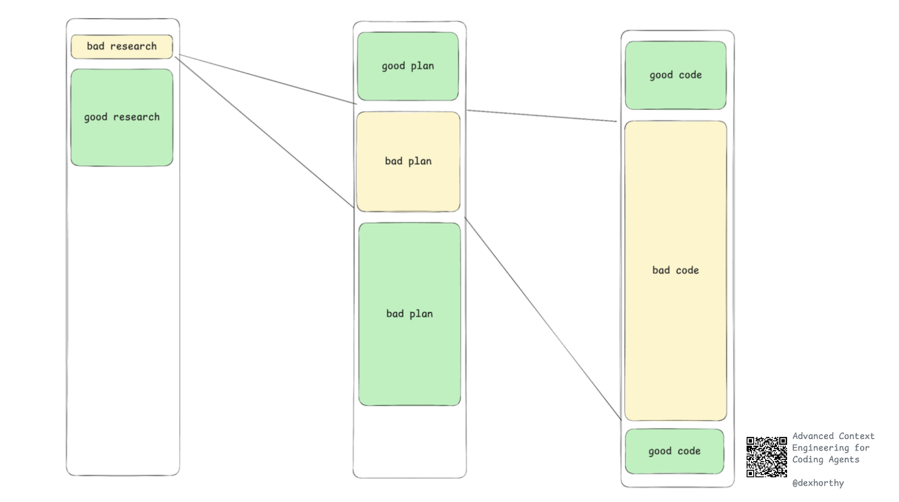
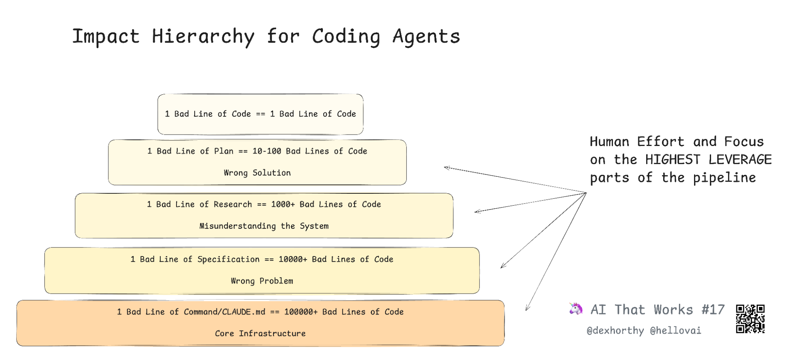

# 🧠 Context Engineering

In our AI-native world, your most powerful tool isn't a piece of software; it's your ability to curate and engineer context. The quality of output from any AI model is a direct reflection of the quality of the context it receives. This is the foundational skill for every role on our team. LLMs in themselves are **nothing more than a pure function**.

Before we get into our own definition of context engineering, I advise you to look into resources:

* [Advanced Context Engineering](https://www.youtube.com/watch?v=VvkhYWFWaKI) by Dexter Horthy **this is a must-watch/read**  
  * **Here’s the write-up. [Go](https://github.com/humanlayer/advanced-context-engineering-for-coding-agents/blob/main/ace-fca.md)** [here\!](https://github.com/humanlayer/advanced-context-engineering-for-coding-agents/blob/main/ace-fca.md)  
* [How to Context Engineering with Claude Code](https://www.youtube.com/watch?v=4nthc76rSl8)

## Context Window

With LLMs being a pure function, they only have something going in and something going out. The LLMs that you work with are only trained on public knowledge, and nothing YourCompany-specific. On top of that, LLMs have a limited context window, so you have to be very careful about what you put in.

The more context you try to jam into a single message, the more likely you are to encounter problems and hallucinations. A good context window size is up to 30-40%, so usually around 300-400k tokens. Beyond that, your model will go into the jokingly; “dumb zone”.

![][image3]

**Read** anthropic’s guide about context windows [here](https://docs.claude.com/en/docs/build-with-claude/context-windows).

[**Context Rot** by Chroma](https://www.youtube.com/watch?v=TUjQuC4ugak)

## Degrading returns and increased risk

It being such that a context window can only include a certain set of information, what happens if we inject a bad piece of information? Think, the wrong Figma file, a PRD that has something in scope, that should be out of scope, etc. Good information can snowball into a lot of good code; this is where you see your 2-5x productivity gains, a piece of bad information will snowball into equal amounts of productivity loss and bad code.

## Context Engineering in Our Workflow

Every major artifact in our product development lifecycle is an act of context engineering:

* **For Product Managers:** You are the primary context engineers. When you create a `prd.md`, you are not just writing a document; you are building the foundational context container for the entire initiative. By synthesizing customer data, business goals, and problem statements into a structured format, you provide the "why" that guides every subsequent step.  
* **For UX Designers:** Your `ux-spec.md` is an act of engineering user experience context. You translate abstract user needs and visual designs into a detailed, logical flow with clear rules and states. This structured documentation is what allows an AI to understand the intended interaction and generate code that reflects it.  
* **For Engineers:** The `technical-spec.md` is the final and most crucial piece of context engineering. You synthesize the "what" and "why" from Product and the user flow from UX into a precise, unambiguous technical blueprint. Your team's **Context Training and Skills** in [devorch](https://github.com/guicheffer/devorch/) are a form of reusable, pre-packaged context, ensuring the AI consistently adheres to your team's standards.

Mastering the art of context engineering is the key to unlocking the full potential of our AI-native workflow. It is human skills that make the AI flow.
