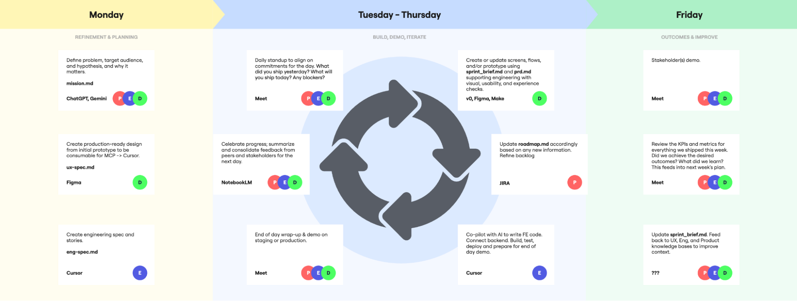

# 🗓️ Rituals & Ceremonies

Our rituals are designed for one purpose: **to maintain momentum**. By creating a predictable rhythm of collaboration, feedback, and execution, we ensure a continuous flow of value from idea to production. This is how we maintain a daily rhythm to enable weekly shipments.

### The Two-Phase Approach: Flow then Sprint

We will operate in two distinct phases to find the working model that best suits each team.

1. **Phase 1: Finding Your Flow (Kanban Style)**  
   * **Goal:** To understand our team's true capacity.  
   * **Process:** We start with a continuous flow model. Product and UX prepare specs, and Engineering pulls them from a "Ready" column as soon as they have capacity. We will track the number of specs completed per week to find our baseline velocity.  
2. **Phase 2: Rhythmic Delivery**  
   * **Goal:** To establish a predictable delivery cadence.  
   * **Process:** Once a team understands its weekly capacity (e.g., "we can consistently complete 5 specs per week"), we switch to a 1 or 2-week cadence. We will plan and commit to a set number of specs for that cadence, providing predictability to our stakeholders.

## The Weekly Cadence

This is our default schedule. Each ceremony is mandatory.

  
[*A circular flow diagram illustrating what a 1-week Make sprint looks like | Miro*](https://miro.com/app/board/uXjVJBEhRV4=/?moveToWidget=3458764643535723268&cot=10)

### Monday: Refinement & Planning

The goal for Monday is to ensure we have a backlog of high-quality, "Ready to Build" specs for the week.

* **Morning (All Hands \- 30 mins): Weekly Kick-off & Demo Review**  
  * Review outcomes and KPIs from the previous week's shipments.  
  * Define the goals and priorities for the current week.  
* **Dual-Track Refinement:**  
  * **Discovery Track (The "Think" Cycle):** Product and UX collaborate to refine upcoming work. This involves analyzing new ideas, prioritizing the backlog, and creating detailed `product-spec.md` and `ux-spec.md` files. The goal is to create a queue of well-defined work for the delivery track.  
  * **Delivery Track (The "Make" Cycle Prep):** Engineering reviews specs that are ready from the discovery track. They provide feedback, ask clarifying questions, identify technical challenges, and create the `technical-spec.md` files. This ensures that when a spec is pulled for development, it's truly ready to go.

### Tuesday \- Thursday: Build, Demo, Iterate

These are our core "Make" days. The cycle is simple: pull a spec, build it, deploy it, demo it.

* **Daily (All Hands \- 15 mins): Daily Standup**  
  * Standard format: What did you ship yesterday? What will you ship today? Any blockers? This is a quick sync, not a status report.  
* **Daily (All Hands \- 30 mins): The Daily Demo**  
  * **This is our most important meeting.**  
  * **Who:** The engineer(s) who shipped something that day will demo it.  
  * **What:** Live, working software in a staging or production environment. No slide decks.  
  * **Why:** To get immediate feedback from the entire team and stakeholders, enabling us to learn and iterate instantly.  
* **Role-Specific Focus:**  
  * **Product (PM):** Attend demos, provide feedback, and be available for real-time clarifications. Continue refining the backlog.  
  * **UX:** Support engineering with any design questions. Conduct rapid usability checks on newly shipped features.  
  * **Engineering:** Pull the next spec from the "Ready" column, build, test, deploy, and prepare to demo.

### Friday: Review Outcomes & Improve

Friday is for reflection, learning, and celebrating our progress.

* **Morning (All Hands \- 30 mins): Final Daily Demo of the Week**  
  * Showcase the last pieces of work shipped for the week.

**Afternoon (All Hands \- 45 mins): Weekly Retrospective & Outcome Review**

* **Part 1: The Process.** What went well? What didn't? What will we improve next week in our process?  
* **Part 2: The Product.** Review the KPIs and metrics for everything we shipped this week. Did we achieve the desired outcomes? What did we learn? This feeds directly into Monday's planning.  
* **Part 3: Compound Learning & Calibrating Scope.** This is where we connect the dots from the week.  
  * **Synthesize Learnings**: We summarize the key takeaways from both the process and product discussions. Every insight is captured in a running document, creating a rich, historical context.  
  * **Inform the 'Think' Cycle**: These documented learnings become a primary input for the next 'Think' cycle, ensuring our future hypotheses are built on a solid foundation of evidence.  
  * **Improve AI Execution:** By referencing this running log of learnings when creating new artifacts (like PRDs or design specs), we provide the AI with crucial context on past decisions and outcomes. This leads to more accurate and effective AI-generated outputs, as the model isn't starting from a blank slate but from a foundation of our collective knowledge.  
  * **Adjust the Sprint Brief**: Based on the week's actual output and the retrospective, we discuss whether our ambition for the next sprint brief matches our capacity. This allows us to calibrate our plans, making them more realistic and sustainable by forecasting next week's work based on the real-world data of what we just accomplished.
