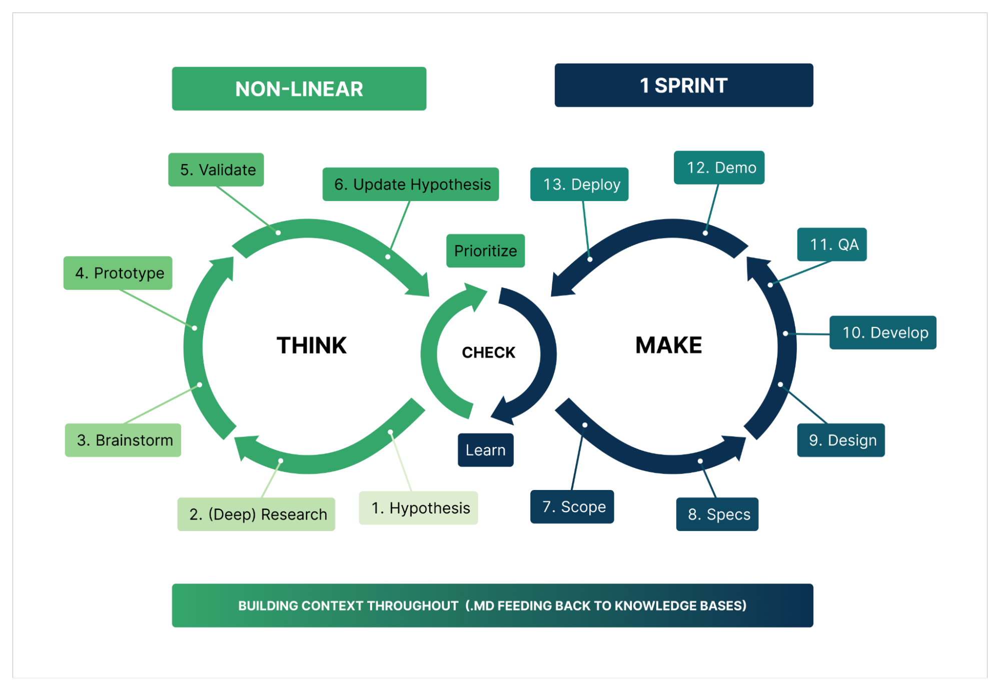
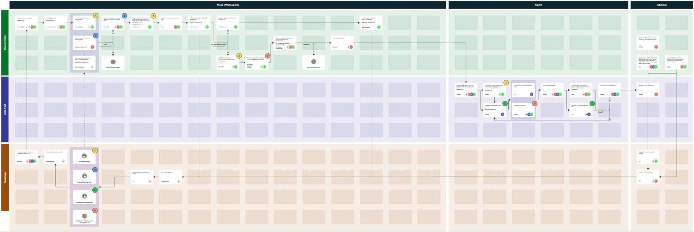

# 📜 The Blueprint: Our AI-Native Dual-Track Process

This document outlines the core methodology for the AI-Native PDLC. Our process is built on a dual-track agile model, separating our work into two distinct but interconnected cycles: **Think** and **Make**. This allows us to continuously discover the right problems to solve while efficiently building and shipping the right solutions.

### The Guiding Philosophy: Think vs. Make

At its heart, our process is a continuous loop of learning and creating. We move fluidly between deep thinking and rapid making, using AI-optimized markdown documents as the connective tissue.

### 🧠 The "Think" Cycle: Discovering the Right Thing to Build

The **Think** cycle is dedicated to discovery, research, and validation. The goal is to deeply understand the problem space and de-risk ideas before committing significant engineering resources.

**Key Activities:**

* **Hypothesis Formation:** It all starts with a clear, testable hypothesis: a proposed explanation for a customer problem or an opportunity that we can validate.
* **Research & Validation:** We gather internal and external context to validate or refine our hypothesis. This can happen before or after the initial hypothesis is formed and includes activities like market analysis, competitor reviews, and synthesizing customer data.
* **Scoping:** We define the initial boundaries of the idea, clarifying what's in and out of scope for the first iteration.
* **Prototype:** We create a functional prototype to visualize the solution and gather early feedback. This could be a UI prototype or a functional code draft.
* **Opportunity Backlog:** Validated ideas are automatically ranked by priority in an opportunity backlog, ready to be pulled into the "Make" cycle.

**Primary Output:** A stack-ranked opportunity backlog, where each item is a context-rich document defining a validated hypothesis.

**Detailed Workflow Steps:** See [Think Cycle workflow-steps](./workflow-steps/README.md#-think-cycle-non-linear-discovery) for step-by-step guidance on [Hypothesis](./workflow-steps/think-01-hypothesis.md), [Deep Research](./workflow-steps/think-02-deep-research.md), [Brainstorm](./workflow-steps/think-03-brainstorm.md), [Prototype](./workflow-steps/think-04-prototype.md), [Validate](./workflow-steps/think-05-validate.md), and [Update Hypothesis](./workflow-steps/think-06-update-hypothesis.md).

### 🛠️ The "Make" Cycle: Building the Right Thing Right

The **Make** cycle is focused on execution, iteration, and delivery. The goal is to rapidly build, test, and ship solutions based on the validated hypotheses from the "Think" cycle.

**Key Activities:**

* **Design:** The user experience is refined based on the prototype.
* **Develop:** The validated design is translated into production-ready code.
* **Experiment:** We ship the feature and run experiments to measure its impact against the original hypothesis.

**Primary Output:** Working software in production and a trail of learnings from experiment summaries. These compounded learnings provide richer context for the next "Think" cycle.

**Detailed Workflow Steps:** See [Make Cycle workflow-steps](./workflow-steps/README.md#-make-cycle-1-sprint-execution) for step-by-step guidance on [Scope](./workflow-steps/make-07-scope.md), [Specs](./workflow-steps/make-08-specs.md), [Design](./workflow-steps/make-09-design.md), [Develop](./workflow-steps/make-10-develop.md), [QA](./workflow-steps/make-11-qa.md), [Demo](./workflow-steps/make-12-demo.md), and [Deploy](./workflow-steps/make-13-deploy.md).

#### Foundational Concepts for the "Make" Cycle

* **Jidoka (Autonomation):** A principle often translated as "automation with a human touch." In our context, this means our automated systems are intelligent enough to stop when a problem or anomaly is detected. For example, if AI-generated code fails a critical security scan or a verification test, the pipeline halts immediately, preventing the issue from moving downstream. This forces a human to intervene, understand the root cause, and improve either the specification or the generation process itself, thus building quality directly into the workflow.  
* **Autonomation:** The practical application of Jidoka. Our goal is to create systems that are not just automated, but *autonomated:* they self-detect errors and surface them for intelligent intervention, continuously improving the reliability of the entire development lifecycle.

### The Detailed Blueprint: End-to-End Workflow

While the "Think vs. Make" model describes our philosophy, the detailed blueprint below maps these cycles to a comprehensive, end-to-end workflow. It illustrates how artifacts are passed between discovery and delivery tracks, and how different roles collaborate at each stage.

This detailed view serves as the operational map for our pilot teams, showing the specific steps, artifacts, and decision points within our AI-native PDLC.

 [*A preview of the current blueprint for AI-native PDLC*](https://miro.com/app/board/uXjVJBEhRV4=/?moveToViewport=-1706.9095951321297%2C-758.9241493052026%2C5884.619620939679%2C2087.1377402827625&resourceId=3458764517258647757)
