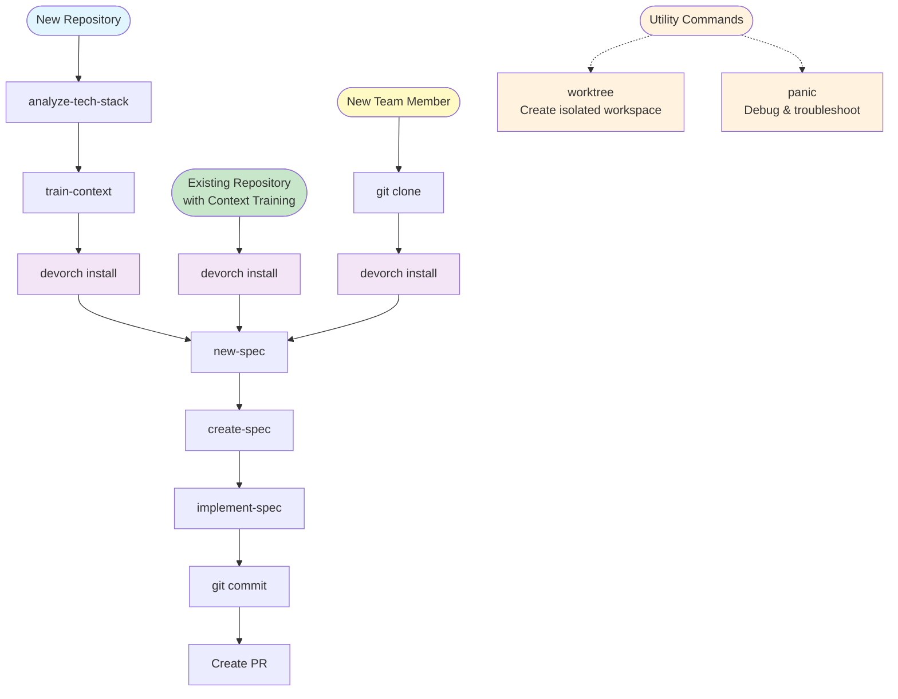

# Command Reference

Complete reference for all devorch slash commands with detailed usage, examples, and troubleshooting.

> **Note**: For installation, CLI setup, and project configuration, see the [Quick Start](./quickstart.md). For an overview of concepts, start with [Core Concepts](./concepts.md).

## Quick Index

### Context & Planning
- [`/analyze-tech-stack`](#analyze-tech-stack) - Document repository tech stack
- [`/train-context`](#train-context) - Generate context training
- [`/load-context-training`](#load-context-training) - Load context training files into context

### Specification Workflow
- [`/gather-requirements`](#gather-requirements) - Research and plan new feature
- [`/create-spec`](#create-spec) - Transform requirements into blueprint
- [`/update-spec`](#update-spec) - Update existing spec with changed requirements
- [`/create-tasks`](#create-tasks) - Break down spec into actionable tasks
- [`/implement-task`](#implement-task) - Implement specific tasks
- [`/implement-spec`](#implement-spec) - Batch implement all tasks
- [`/jira-gather-requirements`](#jira-gather-requirements) - Fetch Jira ticket and post clarifying questions (alternative workflow)
- [`/jira-create-spec`](#jira-create-spec) - Generate spec from Jira ticket + answers (alternative workflow)

### Design & UX
- [`/zest-check`](#zest-check) - Check Figma design implementability for Zest (web & RN)
- [`/a11y-check`](#a11y-check) - Audit Figma designs for accessibility compliance
- [`/create-ux-spec-web`](#create-ux-spec-web) - Generate web dev instructions from Figma
- [`/create-ux-spec-rn`](#create-ux-spec-rn) - Generate React Native dev instructions from Figma
- [`/design-change-web`](#design-change-web) - Implement web design changes from Figma
- [`/design-change-rn`](#design-change-rn) - Implement React Native design changes from Figma
- [`/zest-add-component-web`](#zest-add-component-web) - Add or update Zest components in web repository
- [`/zest-add-component-rn`](#zest-add-component-rn) - Add or update Zest components in React Native

### Utility Commands
- [`/worktree`](#worktree) - Create git worktree with branch
- [`/panic`](#panic) - Debug context collection

---

## Command Matrix

| Command | Parameters | Primary Purpose | Typical Next Step |
|---------|-----------|----------------|------------------|
| `/analyze-tech-stack` | – | Document tech stack | `/train-context` |
| `/train-context` | – (interactive) | Generate context training | `devorch install` |
| `/load-context-training` | – | Load context training files | Use as needed |
| `/gather-requirements` | – (interactive) | Research new feature | `/create-spec` |
| `/create-spec` | – | Generate specification | `/create-tasks` |
| `/update-spec` | – (interactive) | Update existing spec | `/create-tasks` |
| `/create-tasks` | – | Break down into tasks | `/implement-task` or `/implement-spec` |
| `/implement-task` | `<task-id>` | Implement specific task | Continue tasks or PR |
| `/implement-spec` | – | Batch implement all tasks | Commit and PR |
| `/jira-gather-requirements` | `<ticket-key(s)>` (optional) | Fetch Jira ticket, post questions | `/jira-create-spec` |
| `/jira-create-spec` | `<ticket-key(s)>` (optional) | Generate spec from Jira + answers | `/create-tasks` |
| `/zest-check` | – (interactive) | Check Figma for Zest implementability | Fix design or implement |
| `/a11y-check` | – (interactive) | Audit Figma for accessibility | Fix accessibility issues |
| `/create-ux-spec-web` | – (interactive) | Generate web dev instructions | Implement or handoff |
| `/create-ux-spec-rn` | – (interactive) | Generate RN dev instructions | Implement or handoff |
| `/design-change-web` | – (interactive) | Implement web design from Figma | Verify and PR |
| `/design-change-rn` | – (interactive) | Implement RN design from Figma | Verify and PR |
| `/zest-add-component-web` | – (interactive) | Add/update Zest component for web | Test and PR |
| `/zest-add-component-rn` | – (interactive) | Add/update Zest component for RN | Test and PR |
| `/worktree` | `<branch-name>` | Create isolated workspace | Work in worktree |
| `/panic` | – | Collect debug context | Create issue |

---

## Context & Planning Commands

### `/analyze-tech-stack`

**Purpose**: Analyze and document repository's technology stack.

**Parameters**: None

**Usage**:
```
/analyze-tech-stack
```

**What it does**:
1. Analyzes package.json, dependencies
2. Identifies frameworks and libraries
3. Documents patterns and conventions
4. Creates tech-stack.md
5. Prepares for context training

**Example Output**:
```
Analyzing technology stack...

✓ Found: React Native 0.72
✓ Found: TypeScript 5.0
✓ Found: Zustand 4.5 (state management)
✓ Found: React Navigation 6.x
✓ Found: Jest + React Native Testing Library

Created: devorch/tech-stack.md

Tech Stack Summary:
  Platform: React Native (iOS + Android)
  Language: TypeScript
  State: Zustand
  Navigation: React Navigation
  Testing: Jest, RNTL
  UI: Custom design system (Zest)

Next steps:
  1. Review tech-stack.md
  2. Run: /train-context
```

**tech-stack.md Example**:
```markdown
# Tech Stack

## Platform
- React Native 0.72.x
- iOS 14+, Android 8+

## Language
- TypeScript 5.0
- Strict mode enabled

## State Management
- Zustand 4.5.x
- Store patterns documented in zustand-patterns skill

## UI
- Custom design system (Zest)
- Component library: src/components/
- Styling: StyleSheet + theme

## Testing
- Jest 29.x
- React Native Testing Library
- E2E: Detox
```

**When to use**:
- ✅ **Before context training** - Required prerequisite
- ✅ **New project** - Document decisions
- ✅ **Onboarding** - Help new developers
- ✅ **Periodic updates** - Keep current

**Common Issues**:

| Issue | Cause | Solution |
|-------|-------|----------|
| ❌ "No package.json found" | Not in project root | Navigate to project directory |
| ⚠️ Missing some libraries | Not in package.json | Manually add to tech-stack.md |

**Pro Tips**:
- 💡 Required before `/train-context`
- 💡 Auto-detects most technologies
- 💡 Edit to add manual notes
- 💡 Commit to version control

**Related Commands**:
- [`/train-context`](#train-context) - Next step

---

### `/train-context`

**Purpose**: Generate repository-specific context training from codebase analysis.

**Parameters**: None (interactive)

**Usage**:
```
/train-context
```

**What it does**:
1. Checks for tech-stack.md (prerequisite)
2. Offers generation approaches:
   - Analysis-based (PRs, files)
   - Minimal setup
   - Manual creation
3. Analyzes selected sources
4. Generates context training files
5. Updates configuration

**Example Session**:
```
✓ Found tech-stack.md

How would you like to create context training?

1) Analyze PRs and code files
2) Create minimal structure
3) Use starter template

Your choice: 1

Name for context training: mobile-app

What should we analyze?
  [x] Recent PRs (last 20)
  [x] Example files from src/
  [ ] Specific PRs by number

Analyzing...
✓ Analyzed 20 PRs
✓ Analyzed 15 example files
✓ Extracted patterns

Generated context training:
  specification.md  - Spec writing guidelines
  implementation.md - Implementer/verifier listing
  implementers/
    ui.md          - UI implementation preferences
    state.md       - State management patterns
    api.md         - API integration patterns
  verifiers/
    ui.md          - UI verification rules

Skills referenced:
  - react-native-core/component-patterns
  - zustand-patterns
  - zest-design-system

✓ Updated config with context_training: mobile-app

Next steps:
  1. Review generated files
  2. Run: devorch install
```

**Generated Structure**:
```
devorch/context-training/mobile-app/
├── specification.md    # How to write specs
├── implementation.md   # Available implementers
├── implementers/       # Required
│   ├── ui.md          # UI preferences
│   ├── state.md       # State patterns
│   └── api.md         # API patterns
└── verifiers/
    └── ui.md          # Verification rules
```

**When to use**:
- ✅ **After tech stack analysis** - Required
- ✅ **New repository** - Establish patterns
- ✅ **Inconsistent code** - Standardize approaches
- ✅ **Team onboarding** - Document conventions

**Common Issues**:

| Issue | Cause | Solution |
|-------|-------|----------|
| ❌ "Tech stack not found" | Missing tech-stack.md | Run /analyze-tech-stack first |
| ⚠️ Generic context | Few PRs/files | Add more examples or edit manually |
| ⚠️ Missing patterns | Limited analysis | Analyze more PRs or files |

**Pro Tips**:
- 💡 Run /analyze-tech-stack first
- 💡 Choose PRs that represent your standards
- 💡 Can regenerate to improve
- 💡 Edit files to add company-specific rules
- 💡 Commit to version control for team

**Related Commands**:
- [`/analyze-tech-stack`](#analyze-tech-stack) - Required first
- [`devorch install`](./quickstart.md#installation) - Apply context training
- [`/load-context-training`](#load-context-training) - Load context files into conversation

---

### `/load-context-training`

**Purpose**: Load all context-training files into Claude's context for reference.

**Parameters**: None

**Usage**:
```
/load-context-training
```

**What it does**:
1. Checks for context-training configuration
2. Loads all context training files:
   - specification.md (spec guidelines)
   - implementation.md (implementation guidelines)
   - implementers/*.md (domain patterns)
   - verifiers/*.md (verification rules)
3. Makes all files available in conversation context

**Example Output**:
```
📦 Loading context training: mobile-app
   Location: devorch/context-training/mobile-app/

✅ Context training loaded: mobile-app

Files loaded:
- specification.md
- implementation.md
- 3 implementer files:
  - ui-components.md
  - state-management.md
  - api.md
- 2 verifier files:
  - ui-components.md
  - api.md

Total files in context: 7

✅ Context training loaded successfully

Summary:
- Context training: mobile-app
- Total files loaded: 7
- Implementers: 3
- Verifiers: 2

Next steps:
- All context-training files are now available in this conversation
- You can ask questions about patterns, guidelines, or conventions
- Reference specific implementers or verifiers as needed
```

**When to use**:
- ✅ **Reference patterns** - When you need to review conventions
- ✅ **Ask questions** - Query about implementation approaches
- ✅ **Manual review** - Inspect generated context training
- ✅ **Before custom work** - Load patterns before implementing

**Common Issues**:

| Issue | Cause | Solution |
|-------|-------|----------|
| ❌ "No context-training configured" | Missing context training | Run /train-context first |
| ❌ "Directory not found" | Invalid context training | Check config or regenerate |

**Pro Tips**:
- 💡 Use when JIRA commands call it automatically
- 💡 Files stay in context for the conversation
- 💡 Use to understand your project's patterns
- 💡 Optional files (spec.md) won't cause errors

**Related Commands**:
- [`/train-context`](#train-context) - Generate context training first

---

## Specification Workflow Commands

### `/gather-requirements`

**Purpose**: Initialize a new spec and gather requirements through interactive research.

**Parameters**: None (interactive)

**Usage**:
```
/gather-requirements
```

**What it does**:
1. Asks clarifying questions about feature
2. Collects visual assets (screenshots, designs)
3. Identifies similar features in codebase
4. Documents requirements
5. Creates spec folder structure

**Example Session**:
```
What feature are you building?
> User profile page with avatar upload

What's the main user goal?
> Allow users to view and edit their profile information

Are there similar features in the codebase?
> Yes, user settings page

Analyzing similar features...
✓ Found UserSettingsScreen
✓ Found similar form patterns
✓ Found existing avatar handling

Any visual designs to reference?
> [Attach Figma link or screenshots]

Creating specification structure...

✓ Created specs/2025-10-30-user-profile/
✓ Documented requirements
✓ Collected visual assets
✓ Identified reuse opportunities

Next steps:
  1. Review planning/requirements.md
  2. Run: /create-spec
```

**Output Structure**:
```
specs/2025-10-30-user-profile/
└── planning/
    ├── requirements.md    # Initial requirements
    ├── research.md        # Discovery notes
    └── assets/            # Screenshots, designs
        └── profile-mockup.png
```

**When to use**:
- ✅ **Starting new feature** - From scratch
- ✅ **Requirements unclear** - Need discovery
- ✅ **Learning codebase** - Find existing patterns

**Common Issues**:

| Issue | Cause | Solution |
|-------|-------|----------|
| ⚠️ Missing similar features | New codebase | That's okay, document anyway |
| ⚠️ Requirements too vague | Unclear description | Provide more detail |
| 💡 Skip this step? | Requirements already clear | Can create spec folder manually |

**Pro Tips**:
- 💡 Take time with questions - better input = better output
- 💡 Reference existing features accelerates development
- 💡 Visual assets help verifiers later
- 💡 Can iterate on requirements

**Related Commands**:
- [`/create-spec`](#create-spec) - Next step
- [`/analyze-tech-stack`](#analyze-tech-stack) - Better pattern matching

---

### `/create-spec`

**Purpose**: Transform requirements into comprehensive technical specification.

**Parameters**: None (interactive)

**Usage**:
```
/create-spec
```

**What it does**:
1. Reads requirements from research folder
2. Loads all context training and steering
3. Writes detailed `spec.md`
4. Verifies completeness

**When to use**:
- ✅ **After research** - When requirements are clear
- ✅ **Before task planning** - Need technical blueprint
- ✅ **Complex features** - Requiring detailed design

**Example Output Structure**:
```
specs/2025-10-30-user-profile/
├── planning/              # From /gather-requirements
│   ├── requirements.md
│   └── research.md
└── spec.md                # Generated by /create-spec
```

**spec.md Example**:
```markdown
# User Profile Feature

## Overview
Allow users to view and edit their profile information...

## Requirements
- [ ] Display user information
- [ ] Edit profile fields
- [ ] Upload avatar image
- [ ] Save changes to database

## Technical Approach
### Components
- ProfileScreen component
- ProfileForm component
- AvatarUpload component

### Data Flow
[Description of data flow]

### API Integration
- GET /api/user/profile
- PUT /api/user/profile
- POST /api/user/avatar

## Testing Strategy
[Testing approach]
```

**Common Issues**:

| Issue | Cause | Solution |
|-------|-------|----------|
| ❌ "No requirements found" | Missing /gather-requirements step | Run /gather-requirements first |
| ⚠️ Spec too generic | Missing context training | Run /train-context |
| ⚠️ Incomplete spec | Unclear requirements | Update requirements and run again |

**Pro Tips**:
- 💡 Iterative - run multiple times to refine
- 💡 Edit spec.md directly if needed
- 💡 Review before creating tasks
- 💡 Spec focuses on "what" not "how"

**Related Commands**:
- [`/gather-requirements`](#gather-requirements) - Must run first
- [`/create-tasks`](#create-tasks) - Next step
- [`/train-context`](#train-context) - Improve quality
- [`/update-spec`](#update-spec) - Update existing spec

---

### `/update-spec`

**Purpose**: Update an existing specification based on changed requirements.

**Parameters**: None (interactive)

**Usage**:
```
/update-spec
```

**What it does**:
1. Selects existing spec (with stale detection)
2. Displays current spec summary
3. Collects change requests from user
4. Confirms proposed changes
5. Updates requirements.md in-place
6. Regenerates spec.md using spec-writer
7. Re-verifies updated specification

**Example Session**:
```
Active spec is 'user-profile' (2025-10-30). Which spec would you like to use?
> Continue with 'user-profile'

📋 Current Specification Summary for user-profile:

Goal: User profile page with avatar upload

Current Functional Requirements:
- Display user information
- Edit profile fields
- Upload avatar image
...

What would you like to update?
> Modify: Change avatar upload to support multiple image formats
> Add: Add bio text field with 500 character limit

📝 Proposed Changes:

Will be MODIFIED:
- Avatar upload → Support multiple formats (jpg, png, webp)

Will be ADDED:
- Bio text field (500 char max, optional)

Will be PRESERVED (unchanged):
- All display and edit functionality
- Existing form validation
...

Is this change summary correct?
> Yes, proceed with updates

🔄 Updating requirements... Applying your changes one by one. ⏳
✓ Modified avatar upload requirement
✓ Added bio field requirement

📝 Regenerating specification... Using spec-writer to update spec.md
✓ Spec updated

✓ Verification: Passed

✅ Specification updated successfully!

Next step: Run /create-tasks if task breakdown needs updating
```

**Output Structure**:
```
specs/2025-10-30-user-profile/
├── planning/
│   └── requirements.md      # Updated in-place
├── verification/
│   └── spec-verification.md # Regenerated
└── spec.md                  # Regenerated
```

**Change Types Supported**:
- **ADD** - New requirements being added
- **MODIFY** - Existing requirements being changed
- **REMOVE** - Requirements moved to out of scope
- **CLARIFY** - Existing requirements needing more detail

**When to use**:
- ✅ **Pre-implementation iteration** - Refining spec BEFORE creating tasks
- ✅ **Requirements changed** - Scope or functionality evolved before implementation
- ✅ **After feedback** - Stakeholder review requires changes before coding starts
- ✅ **Design iterations** - Visual assets updated during planning phase

**When NOT to use**:
- ❌ **After tasks created** - Use manual edits or create new spec instead
- ❌ **During implementation** - Changes may invalidate existing work
- ❌ **After implementation started** - Risks requiring work to be redone

**Common Issues**:

| Issue | Cause | Solution |
|-------|-------|----------|
| ❌ "No spec.md found" | Spec not created yet | Run /create-spec first |
| ❌ "No requirements.md" | Missing requirements | Run /gather-requirements first |
| ⚠️ "tasks.md exists" | Tasks already created | Choose: proceed with caution, manual edit, or cancel |
| ⚠️ Too many changes | Large update | Consider creating new spec |

**Pro Tips**:
- 💡 **Best used before `/create-tasks`** - For pre-implementation iteration
- 💡 Updates requirements.md in-place (no history section)
- 💡 Tracks changes with todo list during update
- 💡 Regenerates spec and verification fresh
- 💡 Preserves unchanged sections automatically
- 💡 Can add new visual assets during update
- 💡 Reuses spec-writer and spec-verifier (no new subagents)
- 💡 Warns if tasks.md exists (implementation may have started)

**Related Commands**:
- [`/create-spec`](#create-spec) - Initial spec creation
- [`/create-tasks`](#create-tasks) - Update tasks after spec changes
- [`/gather-requirements`](#gather-requirements) - For major scope changes

---

### `/create-tasks`

**Purpose**: Create detailed task breakdown with implementer assignments for efficient implementation.

**Parameters**: None (interactive)

**Usage**:
```
/create-tasks
```

**What it does**:
1. Reads `spec.md` from the current spec folder
2. Discovers available implementers and verifiers
3. Breaks down the spec into logical tasks
4. Assigns implementers to each task based on specialization
5. Creates `tasks.md` with organized breakdown

**Example Output**:
```
✓ Loaded spec: user-profile
✓ Discovered implementers: ui-implementer, data-access-implementer, state-implementer
✓ Created task breakdown with 3 tasks, 12 total subtasks

Task breakdown created successfully!

✅ Tasks file: `tasks.md`
✅ Tasks: 3 tasks with 12 total subtasks
✅ Implementers assigned

👉 Next steps:
   1. Review the task breakdown in `tasks.md`
   2. Run `/implement-task [task-id]` to implement specific tasks
   3. Or run `/implement-spec` to implement all tasks sequentially
```

**Output Structure**:
```
specs/2025-10-30-user-profile/
├── planning/
│   ├── requirements.md
│   └── research.md
├── spec.md
└── tasks.md               # NEW: Generated by /create-tasks
```

**tasks.md Example**:
```markdown
# Implementation Tasks: User Profile

## Task 1: UI Components
**Assigned implementer:** ui-implementer

- [ ] 1.1 Create ProfileScreen component
      - Acceptance: Component renders with proper layout
      - Reuse pattern from: src/screens/UserSettingsScreen.tsx

- [ ] 1.2 Create ProfileForm with validation
      - Acceptance: Form validates all required fields
      - Reuse pattern from: src/components/forms/SettingsForm.tsx

- [ ] 1.3 Add AvatarUpload component
      - Acceptance: Image upload works on iOS and Android
      - Reuse pattern from: src/components/media/ImagePicker.tsx

## Task 2: Data Integration
**Assigned implementer:** data-access-implementer

- [ ] 2.1 Implement profile API client
      - Acceptance: GET/PUT endpoints working
      - Dependencies: 1.1, 1.2

- [ ] 2.2 Add image upload handler
      - Acceptance: Images uploaded to S3
      - Dependencies: 1.3

## Task 3: Verification
**Assigned implementer:** testing-implementer

- [ ] 3.1 Visual regression tests
      - Dependencies: 1.1, 1.2, 1.3

- [ ] 3.2 API integration tests
      - Dependencies: 2.1, 2.2
```

**When to use**:
- ✅ **After spec created** - Ready to plan implementation
- ✅ **Before implementation** - Need clear task breakdown
- ✅ **Complex features** - Multiple areas of responsibility

**Common Issues**:

| Issue | Cause | Solution |
|-------|-------|----------|
| ❌ "No spec found" | Missing /create-spec step | Run /create-spec first |
| ⚠️ Generic implementers | No context training | Run /train-context for domain-specific implementers |
| ⚠️ Too many tasks | Overly detailed spec | Simplify spec or group related tasks |

**Pro Tips**:
- 💡 Tasks automatically organized by domain (UI, State, Data Access, etc.)
- 💡 Pattern references help find reusable code
- 💡 Dependencies tracked to prevent blocked work
- 💡 Can edit tasks.md to adjust task organization

**Related Commands**:
- [`/create-spec`](#create-spec) - Must run first
- [`/implement-task`](#implement-task) - Implement specific tasks
- [`/implement-spec`](#implement-spec) - Batch implement all tasks
- [`/train-context`](#train-context) - Get domain-specific implementers

---

### `/implement-task`

**Purpose**: Implement a specific task or task from the task breakdown.

**Parameters**: `<task-id>` (optional, prompted if not provided)

**Usage**:
```
/implement-task [task-id]
```

**Examples**:
- `/implement-task 1` - Implements entire task 1
- `/implement-task 1.1` - Implements subtask 1.1
- `/implement-task 2.3` - Implements subtask 2.3

**What it does**:
1. Parses task ID from user input
2. Loads task details from `tasks.md`
3. Delegates to assigned implementer
4. Marks task complete with checkbox: `- [x]`
5. Creates implementation report
6. Optionally runs verification

**Example Session**:
```
User: /implement-task 1.1

Loading task 1.1 from tasks.md...
✓ Found task in UI Implementation domain
✓ Task: Create ProfileScreen component
✓ Acceptance: Component renders with proper layout

Implementing...
✓ Loaded UI patterns from context training
✓ Created ProfileScreen.tsx
✓ Added to navigation
✓ Styled with design system
✓ Marked task 1.1 as complete in tasks.md

Task 1.1 implemented successfully! ✅

**Task:** Create ProfileScreen component
**Implementer:** ui-implementer
**Status:** Completed
**Files changed:** 3 files

📄 Implementation report: `implementation/task-1.1-report.md`

👉 Next steps:
   - Review the changes
   - Continue with next task or run `/implement-spec` for remaining tasks
```

**When to use**:
- ✅ **Granular control** - Implement tasks one at a time
- ✅ **Blocked tasks** - Skip blocked tasks and come back later
- ✅ **Review between tasks** - Check work before proceeding
- ✅ **Partial implementation** - Implement subset of tasks

**Common Issues**:

| Issue | Cause | Solution |
|-------|-------|----------|
| ❌ "Task not found" | Invalid task ID | Check tasks.md for valid IDs |
| ❌ "No tasks.md" | Missing /create-tasks step | Run /create-tasks first |
| ⚠️ Dependencies unchecked | Implementing out of order | Check dependencies noted in tasks.md |

**Pro Tips**:
- 💡 Use "1" for entire group, "1.1" for specific task
- 💡 Tasks automatically marked complete in tasks.md
- 💡 Dependencies checked before implementation
- 💡 Implementation report created for each task

**Related Commands**:
- [`/create-tasks`](#create-tasks) - Must run first
- [`/implement-spec`](#implement-spec) - Batch mode alternative

---

### `/implement-spec`

**Purpose**: Batch implementation of all tasks using specialized implementers and verifiers.

**Parameters**: None (uses current spec)

**Usage**:
```
/implement-spec
```

**What it does**:
1. Reads tasks.md from current spec folder
2. Implements all tasks sequentially
3. Delegates to specialized implementers
4. Marks tasks complete as they're finished
5. Optionally runs verification
6. Creates implementation summary

**Example Output**:
```
✓ Loaded spec: user-profile
📋 Found 3 pending tasks with 12 total pending tasks

This will implement all 3 tasks sequentially. This may take significant time. Continue? (yes)

Executing Task 1: UI Components...
  ✓ Created ProfileScreen.tsx
  ✓ Created ProfileForm.tsx
  ✓ Added AvatarUpload component
✅ Task 1 completed (1/3 groups done)

Executing Task 2: Data Integration...
  ✓ Created profile API client
  ✓ Added image upload handler
✅ Task 2 completed (2/3 groups done)

Running Verification...
  ✓ Component tests passing
  ✓ Visual regression clean
  ✓ API integration working

Implementation complete! 🎉

✅ 3 tasks implemented
✅ 12 tasks completed
✅ Verification passed

📄 Summary: `implementation-summary.md`

👉 All done! Review the implementation and consider creating a PR.
```

**Output Structure**:
```
specs/2025-10-30-user-profile/
├── spec.md
├── tasks.md              # Tasks marked complete
├── implementation/
│   ├── task-1-report.md
│   ├── task-2-report.md
│   └── task-3-report.md
├── verification/
│   └── verification-report.md
└── implementation-summary.md
```

**When to use**:
- ✅ **Batch mode** - Implement all tasks at once
- ✅ **After approval** - Spec and tasks reviewed
- ✅ **With verifiers** - Want automated validation
- ✅ **Complex features** - Benefit from specialized agents

**Common Issues**:

| Issue | Cause | Solution |
|-------|-------|----------|
| ❌ "No tasks.md" | Missing /create-tasks step | Run /create-tasks first |
| ⚠️ Tests failing | Implementation incomplete | Review and fix issues |
| ⚠️ Verifier blocked | Missing tools | Install MCP servers |

**Pro Tips**:
- 💡 Specialized implementers prevent context overload
- 💡 Can be interrupted and resumed
- 💡 Use `/implement-task` for granular control instead
- 💡 Implementation documented automatically

**Related Commands**:
- [`/create-tasks`](#create-tasks) - Must run first
- [`/implement-task`](#implement-task) - Granular alternative
- [`/train-context`](#train-context) - Customize implementers

---

### `/jira-gather-requirements`

**Purpose**: Fetch Jira ticket(s), gather requirements through clarifying questions, and post those questions to the Jira ticket(s) for the team to answer. Alternative workflow to `/gather-requirements` when starting from Jira tickets.

**Parameters**: `<ticket-key(s)>` (optional)

**Usage**:
```
/jira-gather-requirements
/jira-gather-requirements PROJ-123
/jira-gather-requirements PROJ-123,PROJ-124
```

**What it does**:
1. Validates Jira CLI prerequisites
2. Fetches ticket(s) from Jira using jira CLI
3. Checks for existing devorch questions (prevents duplicates)
4. Runs `/gather-requirements` with ticket context
5. Extracts clarifying questions from spec-researcher
6. Posts questions to Jira ticket comments
7. Posts summary if no questions needed

**Example Session**:
```
Which Jira ticket(s) would you like to gather requirements for?
> BACKEND-123

Fetching ticket BACKEND-123...
✓ Fetched: Implement user authentication

Checking for existing questions...
✓ No existing questions found

Gathering requirements...
✓ Generated 5 clarifying questions

Posting questions to BACKEND-123...
✓ Posted clarifying questions to Jira ticket

✅ Requirements gathering complete!

Next steps:
  1. Answer questions in Jira ticket
  2. Run: /jira-create-spec BACKEND-123
```

**When to use**:
- ✅ **Starting from Jira** - Ticket already exists
- ✅ **Team workflow** - Requirements discussed in Jira
- ✅ **Async collaboration** - Questions answered asynchronously
- ✅ **Alternative to /gather-requirements** - When source is Jira

**Prerequisites**:
- `jira` CLI (ankitpokhrel/jira-cli) - Required
- Jira configured: `~/.config/.jira/.config.yml`
- `JIRA_API_TOKEN` environment variable

**Common Issues**:

| Issue | Cause | Solution |
|-------|-------|----------|
| ❌ "jira CLI not found" | jira not installed | Install: `brew install jira` (macOS) |
| ❌ "jira not configured" | Missing config | Run: `jira init` |
| ❌ "JIRA_API_TOKEN not set" | Missing token | Export token to ~/.bashrc and ~/.zshrc |
| ⚠️ Questions already posted | Previously run | Skip to /jira-create-spec |

**Pro Tips**:
- 💡 Can process multiple tickets: `PROJ-123, PROJ-124`
- 💡 Checks for duplicate questions automatically
- 💡 Posts summary if no questions needed
- 💡 Questions visible to entire Jira team
- 💡 Works with existing Jira workflow

**Related Commands**:
- [`/jira-create-spec`](#jira-create-spec) - Next step after answers provided
- [`/gather-requirements`](#gather-requirements) - Standard workflow alternative

---

### `/jira-create-spec`

**Purpose**: Generate specification from Jira ticket and answered questions, then post spec back to ticket. Second step in Jira-based workflow after questions are answered.

**Parameters**: `<ticket-key(s)>` (optional)

**Usage**:
```
/jira-create-spec
/jira-create-spec PROJ-123
/jira-create-spec PROJ-123,PROJ-124
```

**What it does**:
1. Validates Jira CLI prerequisites
2. Fetches ticket(s) from Jira
3. Validates that questions have been answered
4. Runs `/create-spec` with ticket + answers context
5. Posts generated spec to Jira ticket
6. Creates local spec folder structure

**Example Session**:
```
Which Jira ticket(s) would you like to create specs for?
> BACKEND-123

Fetching ticket BACKEND-123...
✓ Fetched: Implement user authentication

Validating answers...
✓ Questions answered by team

Creating specification...
✓ Generated spec.md

Posting spec to BACKEND-123...
✓ Posted spec to Jira ticket

✅ Spec creation complete!

Spec folder: specs/2025-01-21-BACKEND-123-user-auth/
  - spec.md (generated)
  - jira-ticket.json (ticket data)

Next steps:
  1. Review spec.md
  2. Run: /create-tasks
```

**When to use**:
- ✅ **After questions answered** - Team provided answers in Jira
- ✅ **Jira workflow** - Continue from /jira-gather-requirements
- ✅ **Team alignment** - Spec visible to entire Jira team
- ✅ **No questions needed** - Can run directly if ticket is clear

**Prerequisites**:
- `jira` CLI (ankitpokhrel/jira-cli) - Required
- Jira configured: `~/.config/.jira/.config.yml`
- `JIRA_API_TOKEN` environment variable

**Common Issues**:

| Issue | Cause | Solution |
|-------|-------|----------|
| ❌ "jira CLI not found" | jira not installed | Install: `brew install jira` (macOS) |
| ❌ "Questions not answered" | Missing answers in ticket | Answer questions in Jira first |
| ⚠️ Incomplete ticket | Missing details | Add more info to Jira ticket |

**Pro Tips**:
- 💡 Can process multiple tickets: `PROJ-123, PROJ-124`
- 💡 Validates answers exist before generating spec
- 💡 Spec posted to Jira for team visibility
- 💡 Creates local spec folder for implementation
- 💡 Works even without questions (if ticket is clear)

**Related Commands**:
- [`/jira-gather-requirements`](#jira-gather-requirements) - Usually run first
- [`/create-tasks`](#create-tasks) - Next step after spec created
- [`/create-spec`](#create-spec) - Standard workflow alternative

---

## Design & UX Commands

### `/design-change-web`

**Purpose**: Implement visual/styling design changes to web applications based on Figma designs with interactive guidance and verification.

**⚠️ Important Limitations**: This command is **only for visual/styling changes** (colors, spacing, typography, layout). It does NOT support adding interactivity, state management, API calls, or business logic.

**Parameters**: None (interactive)

**Usage**:
```
/design-change-web
```

**What it does**:
1. Checks prerequisites (GitHub CLI, Node, Yarn, Chrome DevTools MCP)
2. Collects design input (Figma file or description)
3. Identifies exact location of changes in codebase
4. Analyzes Figma design specifications
5. Implements design changes following design system
6. Optionally shows changes locally
7. Creates PR with GitHub Actions monitoring

**Example Session**:
```
Design Change: [Figma link or description]
> https://www.figma.com/design/xyz?node-id=1-123

Change locality: Where should this change be made?
> Main CTA button on the homepage

Ticket number: JIRA ticket for the PR
> EPS-1000

Analyzing Figma design...
✓ Extracted design tokens
✓ Identified components

Finding implementation files...
✓ Located homepage component
✓ Found CTA button

Implementing changes...
✓ Updated button styles
✓ Applied design system tokens

Creating PR: feature/EPS-1000-change-button-size
✓ PR created
✓ Monitoring GitHub Actions
✓ All checks passing

Preview URL: https://preview.example.com/pr-123
```

**When to use**:
- ✅ **Visual design changes** - Colors, spacing, typography, layout
- ✅ **Design handoff** - Implementing Figma visual designs for web
- ✅ **Design updates** - Updating styles in existing UI
- ✅ **Design system compliance** - Ensuring Figma matches design tokens
- ✅ **Non-technical designers** - Guided implementation workflow

**When NOT to use**:
- ❌ **Adding interactivity** - Click handlers, form submissions, etc.
- ❌ **State management** - Component state or logic changes
- ❌ **API integration** - Adding or modifying API calls
- ❌ **Business logic** - Adding effects or complex logic

**Prerequisites**:
- `gh` CLI (GitHub CLI) - Required
- `node` and `yarn` - Optional but recommended for local preview
- Chrome DevTools MCP - Optional for verification

**Common Issues**:

| Issue | Cause | Solution |
|-------|-------|----------|
| ❌ "GitHub CLI not found" | gh not installed | Install: https://cli.github.com/ |
| ❌ "Chrome DevTools not available" | MCP not configured | Install chrome-devtools MCP |
| ⚠️ Ambiguous location | Multiple possible locations | Answer clarifying questions |

**Pro Tips**:
- 💡 Select a specific frame in Figma, not the full file
- 💡 Provide clear change locality to speed up implementation
- 💡 Use with Figma MCP for design token extraction
- 💡 Command monitors GitHub Actions until all checks pass
- 💡 Designed for non-technical designers to create PRs

**Related Commands**:
- [`/zest-check`](#zest-check) - Check design implementability before implementation

---

### `/zest-check`

**Purpose**: Check Figma design implementability for the Zest design system on both web and React Native platforms.

**Parameters**: None (interactive)

**Usage**:
```
/zest-check
```

**What it does**:
1. Checks for Figma MCP prerequisite
2. Collects Figma file from user (frame-level URL required)
3. Runs both web and React Native analysis subagents in parallel
4. Extracts design tokens and maps to Zest equivalents
5. Generates implementability scores for each platform
6. Highlights platform discrepancies

**Example Session**:
```
Figma file: Provide Figma design link (select a specific frame)
> https://www.figma.com/design/xyz?node-id=1-123

Running platform analysis...

Zest Implementability Check Complete

| Platform       | Score | Status                      |
|----------------|-------|-----------------------------|
| Web            | 9/10  | Fully implementable         |
| React Native   | 7/10  | Minor custom styling needed |

Platform Discrepancies:
- Gradient backgrounds: Available in web, needs custom in RN
- Shadow blur: Different implementation patterns

Web Analysis:
✓ 12/15 colors match Zest tokens
✓ All spacing values match
✓ Typography styles match

React Native Analysis:
✓ 12/15 colors map to alias.color tokens
⚠ 2 spacing values need adjustment
✓ Typography maps to Text types

Recommendations:
- Replace #FF5733 with primary.600
- Use global.spacing.md instead of 18px
```

**When to use**:
- ✅ **Before implementation** - Validate design feasibility
- ✅ **Design review** - Check design system compliance
- ✅ **Cross-platform projects** - Verify both web and RN support
- ✅ **Design handoff** - Identify potential issues early

**Prerequisites**:
- Figma MCP - Required for design token extraction

**JIRA Integration**: Use `/jira-zest-check [TICKET-KEY]` to post results to a Jira ticket.

**Related Commands**:
- [`/a11y-check`](#a11y-check) - Check accessibility compliance
- [`/create-ux-spec-web`](#create-ux-spec-web) - Generate web dev instructions
- [`/create-ux-spec-rn`](#create-ux-spec-rn) - Generate RN dev instructions

---

### `/a11y-check`

**Purpose**: Audit Figma designs for accessibility compliance.

**Parameters**: None (interactive)

**Usage**:
```
/a11y-check
```

**What it does**:
1. Checks for Figma MCP prerequisite
2. Collects Figma file from user
3. Analyzes color contrast ratios
4. Verifies touch target sizes
5. Reviews text readability
6. Generates accessibility compliance report

**When to use**:
- ✅ **Accessibility audit** - Ensure WCAG compliance
- ✅ **Design review** - Catch accessibility issues early
- ✅ **Before implementation** - Avoid accessibility debt

**JIRA Integration**: Use `/jira-a11y-check [TICKET-KEY]` to post results to a Jira ticket.

**Related Commands**:
- [`/zest-check`](#zest-check) - Check design system compliance

---

### `/create-ux-spec-web`

**Purpose**: Generate detailed web development instructions from a Figma design.

**Parameters**: None (interactive)

**Usage**:
```
/create-ux-spec-web
```

**What it does**:
1. Extracts all design tokens from Figma
2. Maps tokens to Zest web equivalents
3. Identifies all components needed
4. Generates code snippets for each component
5. Creates a markdown spec document

**Output**: A markdown document saved to `.devorch/artifacts/ux-specs/` containing:
- Design token mapping table (Figma → Zest)
- Component breakdown with exact props
- Layout structure (Box hierarchy)
- Code snippets
- Responsive considerations

**When to use**:
- ✅ **Design handoff** - Provide clear dev instructions
- ✅ **Before implementing** - Understand the full scope
- ✅ **Documentation** - Create implementation reference

**Related Commands**:
- [`/zest-check`](#zest-check) - Check design first
- [`/design-change-web`](#design-change-web) - Implement the design

---

### `/create-ux-spec-rn`

**Purpose**: Generate detailed React Native development instructions from a Figma design.

**Parameters**: None (interactive)

**Usage**:
```
/create-ux-spec-rn
```

**What it does**:
1. Extracts all design tokens from Figma
2. Maps tokens to Zest RN equivalents (global.*, alias.*)
3. Identifies all components needed
4. Generates useZestStyles code patterns
5. Creates a markdown spec document

**Output**: A markdown document saved to `.devorch/artifacts/ux-specs/` containing:
- Design token mapping (Figma → global.spacing.*, alias.color.*, etc.)
- Component breakdown with Zest RN components
- useZestStyles patterns with createStylesConfig
- Image handling with ImageCloudinary
- Accessibility requirements (testID, altText)
- Responsive design considerations

**When to use**:
- ✅ **Design handoff** - Provide clear RN dev instructions
- ✅ **Before implementing** - Understand the full scope
- ✅ **Documentation** - Create implementation reference

**Related Commands**:
- [`/zest-check`](#zest-check) - Check design first
- [`/design-change-rn`](#design-change-rn) - Implement the design

---

### `/design-change-rn`

**Purpose**: Implement visual/styling design changes in React Native modules (shared-mobile-modules) from Figma designs.

**Parameters**: None (interactive)

**Usage**:
```
/design-change-rn
```

**What it does**:
1. Checks prerequisites (gh CLI, Mobile MCP)
2. Collects Figma design and change description
3. Identifies target module and screen
4. Implements visual changes using Zest RN tokens
5. Can verify changes on simulators via Mobile MCP
6. Creates pull request with GitHub Actions monitoring

**Important Limitations**:
This command is **only for visual/styling changes**:
- ✅ Colors, spacing, typography
- ✅ Layout and positioning
- ✅ Component styling
- ❌ Interactivity, state, or business logic

**Prerequisites**:
- GitHub CLI (`gh`)
- Figma MCP
- Mobile MCP (optional, for simulator verification)

**Related Commands**:
- [`/zest-check`](#zest-check) - Check design first
- [`/create-ux-spec-rn`](#create-ux-spec-rn) - Generate dev instructions
- [`/design-change-web`](#design-change-web) - Web equivalent

---

### `/zest-add-component-web`

**Purpose**: Add or update Zest design system components in the web repository based on Figma designs.

**Parameters**: None (interactive)

**Usage**:
```
/zest-add-component-web
```

**What it does**:
1. Checks prerequisites (GitHub CLI, node, yarn)
2. Collects operation type (NEW or UPDATE existing component)
3. Collects Figma design and component details
4. Extracts design tokens and component structure from Figma
5. Analyzes established patterns from production PRs
6. Generates or updates component files in `packages/zest/`:
   - ComponentName.tsx (main component with Figma reference)
   - types.ts (TypeScript interfaces with JSDoc)
   - styles.ts (design tokens, never hardcoded values)
   - variants.ts (variant configurations, if applicable)
   - ComponentName.test.tsx (comprehensive tests + snapshots)
   - index.ts (exports)
7. Creates Storybook documentation
8. Optionally runs tests and Storybook locally (if node/yarn available)
9. Creates PR with proper templates
10. Monitors GitHub Actions and auto-fixes common issues

**Example Session (NEW component)**:
```
Operation type: Are you adding a NEW component or UPDATING existing?
> New component

Figma file: Provide Figma design for the component
> https://www.figma.com/design/xyz?node-id=1-456

Component name: What should the component be called?
> Badge

Component description: Brief description (1-2 sentences)
> A badge component for displaying status indicators and labels

Ticket number: JIRA ticket for the PR
> ZEST-2426

Analyzing Figma design...
✓ Extracted design tokens
✓ Identified component structure
✓ Determined variants: neutral, brand, success, error
✓ Determined sizes: sm, md, lg

Following established patterns from production PRs...
✓ Pattern: Simple Component (single-level)
✓ Using Zest primitives: Box, Text

Generating component files...
✓ Created types.ts with JSDoc
✓ Created styles.ts with design tokens
✓ Created variants.ts
✓ Created Badge.tsx with Figma reference
✓ Created Badge.test.tsx with full coverage
✓ Created index.ts
✓ Updated packages/zest/src/index.ts exports
✓ Created Storybook documentation

Running tests locally...
✓ All tests passing

Creating PR: feature/ZEST-2426-add-badge-component
✓ PR created
✓ Monitoring GitHub Actions
✓ All checks passing ✅

Component created successfully!
Location: packages/zest/src/Badge/
```

**Generated Files (NEW component)**:
```
packages/zest/src/Badge/
├── Badge.tsx           # Component with Figma reference
├── types.ts            # TypeScript interfaces with JSDoc
├── styles.ts           # Design tokens only
├── variants.ts         # Variant configurations
├── Badge.test.tsx      # Comprehensive tests + snapshots
└── index.ts            # Barrel export

apps/zest-docs/stories/
└── Badge.stories.tsx   # Storybook documentation
```

**When to use**:
- ✅ **New design system component** - Adding to Zest web library
- ✅ **Updating existing component** - Adding variants, props, or features
- ✅ **Design-to-code** - Direct Figma-to-component workflow
- ✅ **Designers working independently** - Follows production patterns exactly

**Prerequisites**:
- `gh` CLI (GitHub CLI) - **Required**
- Figma access - **Required** for design extraction
- `node` + `yarn` - Optional (enables local testing)
- Playwright or Chrome DevTools MCP - Optional (enables automated testing)

**Key Features**:
- ✅ **Follows production patterns** - Uses real PR patterns from `zest-components-web-patterns` skill
- ✅ **NEW or UPDATE** - Can add new components or update existing ones
- ✅ **Design tokens only** - Never hardcodes values
- ✅ **Full test coverage** - Comprehensive tests with snapshots
- ✅ **Storybook docs** - Auto-generates documentation
- ✅ **CI monitoring** - Auto-fixes common TypeScript/lint errors
- ✅ **Figma traceability** - Reference comment in component

**Common Issues**:

| Issue | Cause | Solution |
|-------|-------|----------|
| ❌ "GitHub CLI not found" | gh not installed | Install: https://cli.github.com/ |
| ❌ "Not in web repository" | Wrong directory | Navigate to web repo |
| ⚠️ Too much context | Full Figma file provided | Select specific frame in Figma |
| ⚠️ Component exists | Trying to create existing | Use "Update existing" operation |

**Pro Tips**:
- 💡 Select a specific Figma frame, not the entire file
- 💡 Component name should be PascalCase (e.g., Badge, ProgressBar)
- 💡 Command asks if NEW or UPDATE - reads existing files for updates
- 💡 Uses real production patterns from past PRs (Badge, Accordion, Button)
- 💡 Auto-generates comprehensive tests with accessibility checks
- 💡 Can work without local environment - PR created and CI handles validation
- 💡 With node/yarn: runs tests locally and can preview in Storybook

**Related Commands**:
- [`/zest-check`](#zest-check) - Check design implementability before creating component
- [`/design-change-web`](#design-change-web) - Implement design changes in apps
- [`/zest-add-component-rn`](#zest-add-component-rn) - React Native equivalent

---

### `/zest-add-component-rn`

**Purpose**: Add or update Zest design system components in the React Native repository based on Figma designs.

**Parameters**: None (interactive)

**Usage**:
```
/zest-add-component-rn
```

**What it does**:
1. Checks prerequisites (GitHub CLI)
2. Collects operation type (NEW or UPDATE existing component)
3. Collects Figma design and component details
4. Extracts design tokens and component structure from Figma
5. Analyzes established patterns from zest-react-native
6. Generates or updates component files using Zest RN tokens:
   - ComponentName.tsx (main component)
   - types.ts (TypeScript interfaces)
   - styles.ts (useZestStyles with createStylesConfig)
   - ComponentName.test.tsx (tests)
   - index.ts (exports)
7. Creates PR with proper templates

**Example Session**:
```
Operation type: Are you adding a NEW component or UPDATING existing?
> New component

Figma file: Provide Figma design for the component
> https://www.figma.com/design/xyz?node-id=1-456

Component name: What should the component be called?
> Badge

Component description: Brief description (1-2 sentences)
> A badge component for displaying status indicators

Ticket number: JIRA ticket for the PR
> ZEST-2427

Analyzing Figma design...
✓ Extracted design tokens (mapped to global.*/alias.*)
✓ Identified component structure
✓ Determined variants: neutral, brand, success, error

Generating component files...
✓ Created types.ts
✓ Created styles.ts with useZestStyles
✓ Created Badge.tsx
✓ Created Badge.test.tsx
✓ Created index.ts

Creating PR: feature/ZEST-2427-add-badge-component
✓ PR created

Component created successfully!
```

**Key Differences from Web**:
- Uses Zest RN tokens (`global.spacing.*`, `alias.color.*`)
- Uses `useZestStyles` hook with `createStylesConfig`
- No Storybook (RN uses different documentation approach)
- Different file structure matching zest-react-native patterns

**When to use**:
- ✅ **New RN design system component** - Adding to Zest React Native library
- ✅ **Updating existing component** - Adding variants, props, or features
- ✅ **Design-to-code** - Direct Figma-to-component workflow

**Related Commands**:
- [`/zest-check`](#zest-check) - Check design implementability before creating component
- [`/design-change-rn`](#design-change-rn) - Implement design changes in apps
- [`/zest-add-component-web`](#zest-add-component-web) - Web equivalent

---

## Utility Commands

### `/worktree`

**Purpose**: Create git worktree for isolated feature development.

**Parameters**: `<branch-name>` (optional)

**Usage**:
```
/worktree
/worktree feature/new-feature
```

**What it does**:
1. Gets branch name from you (if not provided)
2. Creates git worktree in `./worktrees/`
3. Copies local settings (.env, .mcp.json)
4. Provides next steps

**Example**:
```
Enter branch name: feature/user-profile

Creating worktree...
✓ Created ./worktrees/feature-user-profile
✓ Copied .env
✓ Copied .mcp.json

Next steps:
  cd ./worktrees/feature-user-profile
  # Work on feature in isolation
```

**When to use**:
- ✅ **Parallel features** - Multiple features simultaneously
- ✅ **Experimental work** - Try without affecting main
- ✅ **Long-running features** - Isolate WIP

**Pro Tips**:
- 💡 Each worktree is independent directory
- 💡 Shares git history, not working files
- 💡 Settings copied automatically
- 💡 Remove with `git worktree remove`

---

### `/panic`

**Purpose**: Collect comprehensive debug context for troubleshooting.

**Parameters**: None

**Usage**:
```
/panic
```

**What it does**:
1. Verifies git CLI available
2. Collects error logs and stack traces
3. Gathers system information
4. Creates formatted debug report
5. Optionally creates GitHub issue

**Example Output**:
```
Collecting debug context...

✓ Git status
✓ Recent error logs
✓ Stack traces
✓ System information
✓ Recent changes

Created: debug-report-2025-10-30.md

Would you like to create a GitHub issue? [Y/n]
```

**debug-report.md Example**:
```markdown
# Debug Report - 2025-10-30

## Environment
- OS: macOS 14.0
- Node: v20.0.0
- devorch: v2.0.0

## Git Status
Current branch: feature/user-profile
Changes: 5 modified, 2 new

## Error Log
[Recent errors and stack traces]

## Recent Changes
[Last 5 commits]

## Context
[Additional context if provided]
```

**When to use**:
- ✅ **Something broken** - Unclear what's wrong
- ✅ **Need help** - Preparing bug report
- ✅ **Investigation** - Systematic troubleshooting

**Pro Tips**:
- 💡 Run when stuck or confused
- 💡 Attach report to issues
- 💡 Includes sensitive info - review before sharing
- 💡 Helps maintainers debug

---

## Workflow Diagram



## Workflow Examples

### Complete Feature Flow

```bash
# 1. Setup context (once per repository)
/analyze-tech-stack
/train-context

# 2. Research feature
/gather-requirements

# 3. Create specification
/create-spec

# 4. Create task breakdown
/create-tasks

# 5. Implement
/implement-spec

# 5. Commit and PR
git add .
git commit -m "Add user profile feature"
gh pr create
```

### Existing Repository Flow

```bash
# Repository already has context training committed
# Just install and start building

# 1. Install (uses existing context training from repo)
devorch install

# 2. Build feature
/gather-requirements
/create-spec
/create-tasks
/implement-spec

# 3. Commit and PR
git add .
git commit -m "Add new feature"
gh pr create
```

### New Team Member Flow

```bash
# Joining a project that already uses devorch

# 1. Clone repository
git clone <repo-url>
cd <repo-directory>

# 2. Install (automatically uses team's context training)
devorch install

# 3. Start contributing
/gather-requirements
/create-spec
/create-tasks
/implement-spec
```

---

## Tips & Best Practices

### Context Training
- 💡 Run `/analyze-tech-stack` and `/train-context` for best results
- 💡 Regenerate periodically as codebase evolves
- 💡 Edit files to add company-specific rules
- 💡 Different teams can use different context trainings

### Specification Workflow
- 💡 Start with `/gather-requirements` for new features
- 💡 Use `/create-spec` to write specifications
- 💡 Use `/create-tasks` to break down into actionable tasks
- 💡 Use `/implement-task` for granular control or `/implement-spec` for batch mode
- 💡 Review specs and tasks before implementation

### Implementation
- 💡 Specialized implementers prevent context overload
- 💡 Verifiers use MCP servers for automation
- 💡 Implementation documented automatically
- 💡 Can resume if interrupted

### Utilities
- 💡 Use `/worktree` for parallel work
- 💡 Run `/panic` when stuck
- 💡 Commit context training to version control

---

## Troubleshooting

### "Command not found in IDE"
**Cause**: Installation incomplete
**Solution**: Restart IDE after running `devorch install`

### "No requirements found"
**Cause**: Missing /gather-requirements step
**Solution**: Run /gather-requirements first to create spec folder

### "Spec too generic"
**Cause**: Missing context training
**Solution**: Run /train-context to customize

### "Tests failing during implementation"
**Cause**: Implementation incomplete
**Solution**: Review and fix issues before continuing

### "Context training not found"
**Cause**: Referenced context training doesn't exist
**Solution**: Run /train-context or fix name in config

---

## Environment Variable Overrides

Override config fields without modifying committed configuration:

```bash
# Override context training
export DEVORCH_CONTEXT_TRAINING=backend-api

# Override multiple fields
export DEVORCH_NAME=my-fork
export DEVORCH_VERSION=v1.2.3

# Then install
devorch install
```

**Supported Variables**:
- `DEVORCH_CONTEXT_TRAINING` → `profile.context_training`
- `DEVORCH_NAME` → `profile.name`
- `DEVORCH_VERSION` → `profile.version`
- `DEVORCH_DESCRIPTION` → `profile.description`

---

## Related Documentation

- [Quick Start](./quickstart.md) - Get started with devorch
- [Configuration Guide](./configuration.md) - Detailed config reference
- [Context Training Guide](./context-training.md) - Customization system
- [Workflows](./workflows.md) - When and how to use commands

---

**Last Updated**: 2025-01-10
**Version**: 2.0.0
