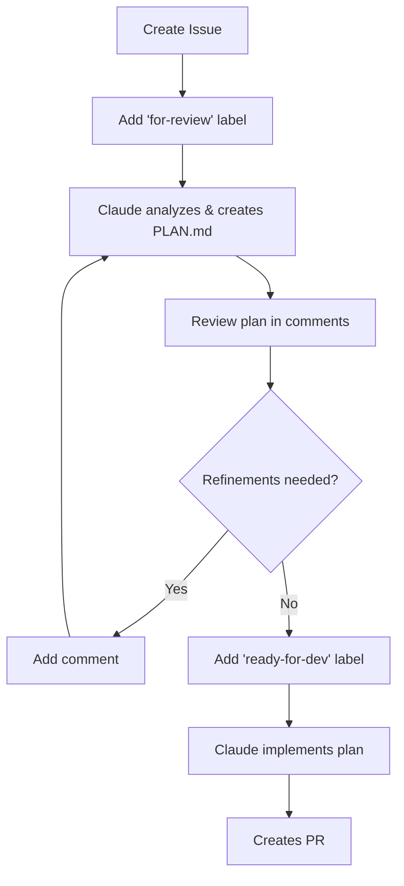

# GitHub Actions Integration

This guide explains how to use devorch's GitHub Actions workflows for automated issue review and implementation with Claude Code.

## Overview

Two workflows automate the issue-to-PR lifecycle:

1. **Issue Review** (`issue-review.yml`) - Analyzes issues, explores codebase, creates implementation plans
2. **Issue Implementation** (`issue-implement.yml`) - Executes plans, creates PRs

## Workflow



## Setup

### 1. AWS Bedrock Authentication

The workflows use AWS Bedrock for Claude API access via OIDC authentication.

**Required Setup:**
1. Configure AWS OIDC provider for GitHub Actions in your AWS account
2. Create IAM role with Bedrock model invocation permissions
3. Update the role ARN in both workflow files:
   - `.github/workflows/issue-review.yml`
   - `.github/workflows/issue-implement.yml`

**Current configuration uses:**
```yaml
role-to-assume: arn:aws:iam::951719175506:role/github-actions-invoke-model
aws-region: eu-west-1
```

**No API keys needed!** Authentication happens via OIDC id-token.

### 2. Self-Hosted Runners

The workflows use `self-hosted` runners to access AWS credentials via OIDC.

**Required:**
- Set up GitHub self-hosted runners with AWS credentials configured
- Runners must have access to the AWS role specified in the workflows

**To use GitHub-hosted runners instead:**
1. Change `runs-on: self-hosted` to `runs-on: ubuntu-latest` in both workflows
2. Set up AWS credentials using GitHub secrets instead of OIDC

### 3. Required Labels

Create these labels in your repository (`Issues > Labels > New label`):

- `for-review` - Triggers Claude to analyze and create implementation plan
- `ready-for-dev` - Triggers Claude to implement the plan

## Usage

### Step 1: Create Issue & Request Review

1. Create a new issue describing what you want to implement
2. Add the `for-review` label
3. Claude automatically:
   - Explores relevant code
   - Understands architecture
   - Creates detailed PLAN.md with code examples
   - Posts plan as comment
   - Creates feature branch: `feature/{issue-number}-{issue-slug}`

**Example Issue:**
```markdown
Title: Add user authentication with OAuth

Body:
We need to add OAuth authentication to support Google and GitHub login.

Requirements:
- Support Google OAuth 2.0
- Support GitHub OAuth
- Store tokens securely
- Refresh token handling
```

### Step 2: Refine Plan (Optional)

1. Review the plan comment
2. Add comments with feedback or questions
3. Claude automatically refines the plan based on each comment
4. Repeat until satisfied

**Example Refinement Comment:**
```markdown
Can you also add support for token refresh in the background?
Let's use Redis for session storage instead of in-memory.
```

### Step 3: Start Implementation

1. When plan is ready, add the `ready-for-dev` label
2. Claude automatically:
   - Checks out feature branch
   - Executes each phase sequentially
   - Updates PLAN.md checkboxes as tasks complete
   - Creates atomic commit per phase
   - Creates PR when complete

### Step 4: Review & Merge

1. Review the PR created by Claude
2. Request changes if needed
3. Merge when ready

## Plan Format

Claude creates PLAN.md with this structure:

```markdown
# Feature Name

## Context
Brief explanation of what needs to be done and why.

## Architecture Analysis
Relevant files, patterns, and architectural decisions.

## Phase 1: Setup Authentication Infrastructure
- [ ] Create auth service in src/services/auth.ts
- [ ] Add OAuth config types
- [ ] Install dependencies (passport, passport-google-oauth20)

**Example code for Phase 1:**
\`\`\`typescript
// src/services/auth.ts:1
import { OAuth2Client } from 'google-auth-library';

export class AuthService {
  private googleClient: OAuth2Client;

  constructor(clientId: string, clientSecret: string) {
    this.googleClient = new OAuth2Client(clientId, clientSecret);
  }

  async verifyGoogleToken(token: string) {
    // Implementation...
  }
}
\`\`\`

## Phase 2: Add OAuth Routes
- [ ] Create /auth/google route
- [ ] Create /auth/github route
- [ ] Add callback handlers

## Phase 3: Token Management
- [ ] Add Redis token storage
- [ ] Implement refresh logic
- [ ] Add token cleanup job
```

## Advanced Configuration

### Custom Branch Naming

Branch names are auto-generated as: `feature/{issue-number}-{issue-slug}`

Example:
- Issue #42: "Add user authentication" → `feature/42-add-user-authentication`

### Adjust Claude Parameters

Edit the workflows to customize:

```yaml
claude_args: |
  --max-turns 30                           # Increase for complex tasks
  --model claude-sonnet-4-5-20250929       # Use different model
  --allowedTools Read,Write,Edit,Bash      # Restrict tools
```

### Self-Hosted Runners

Change `runs-on` to use your runners:

```yaml
jobs:
  review-issue:
    runs-on: self-hosted  # or [self-hosted, linux, x64]
```

### Concurrent Runs

Workflows use concurrency control to prevent conflicts:

```yaml
concurrency:
  group: issue-review-${{ github.event.issue.number }}
  cancel-in-progress: false
```

## Troubleshooting

### Review workflow doesn't trigger

**Check:**
- Label is exactly `for-review` (case-sensitive)
- Workflow file exists in `.github/workflows/`
- Self-hosted runner is available and configured
- AWS credentials are properly set up

**Debug:**
Go to `Actions` tab and check workflow runs.

### Implementation fails on a phase

**Recovery:**
1. Review workflow logs to see the blocker
2. Fix issues manually or refine plan
3. Remove and re-add `ready-for-dev` label to retry

### PLAN.md not found

**Cause:** Implementation triggered before review completed.

**Fix:**
1. Remove `ready-for-dev` label
2. Ensure `for-review` workflow completed successfully
3. Verify PLAN.md exists on feature branch
4. Re-add `ready-for-dev` label

### Plan refinement not working

**Check:**
- Issue still has `for-review` label (required)
- Comment is from authenticated user
- Workflow has write permissions

### PR already exists error

**Cause:** Workflow re-triggered after PR was created.

**Fix:** This is expected - the workflow will update the existing PR comment.

## How It Works

### Review Workflow

1. **Trigger Detection**
   - Listens for `issues.labeled` and `issue_comment.created` events
   - Checks if label is `for-review`

2. **Branch Management**
   - Creates or checks out feature branch: `feature/{issue-number}-{slug}`
   - Sanitizes issue title for valid branch names

3. **Plan Generation**
   - Generates prompt with issue context
   - Runs Claude Code with exploration tools enabled
   - Claude explores codebase and creates PLAN.md

4. **Result Posting**
   - Commits PLAN.md to feature branch
   - Posts plan in collapsible comment
   - Uploads PLAN.md as artifact (30-day retention)

5. **Refinement Loop**
   - Each new comment triggers plan update
   - Claude refines PLAN.md based on feedback
   - Updates the same comment (not new comments)

### Implementation Workflow

1. **Plan Parsing**
   - Downloads PLAN.md from feature branch
   - Parses phases using `parse-plan.ts` script
   - Generates matrix of incomplete phases

2. **Sequential Execution**
   - Runs phases one at a time (`max-parallel: 1`)
   - Each phase gets isolated Claude Code session
   - Phase-specific prompt focuses execution

3. **Progress Tracking**
   - Claude updates checkboxes in PLAN.md: `- [ ]` → `- [x]`
   - Creates atomic commit per phase
   - Git history shows clear progression

4. **PR Creation**
   - After all phases complete, creates PR
   - Links back to original issue
   - Posts success comment on issue

5. **Failure Handling**
   - `fail-fast: true` stops on first blocker
   - Posts failure comment with logs link
   - Remove/re-add label to retry

## Integration with devorch

These workflows are designed to work alongside devorch's CLI tools:

- **Local development**: Use `/execute-plan` command
- **CI/CD**: Use GitHub Actions workflows
- **Hybrid**: Create plan locally, execute in CI

## Examples

### Simple Bug Fix

**Issue:**
```markdown
Title: Fix pagination on user list

Bug: Pagination buttons don't update when page changes.
```

**Generated Plan:**
```markdown
## Phase 1: Identify Bug Location
- [ ] Find pagination component in src/components/UserList.tsx:45

## Phase 2: Fix State Update
- [ ] Update handlePageChange to properly update state

## Phase 3: Add Test
- [ ] Add test for pagination state updates
```

### Complex Feature

**Issue:**
```markdown
Title: Add real-time notifications system

Requirements:
- WebSocket connection for live updates
- Notification center UI
- Persistence in database
- Push notifications on mobile
```

**Generated Plan:**
```markdown
## Phase 1: WebSocket Infrastructure
- [ ] Set up Socket.IO server
- [ ] Create connection middleware
- [ ] Add authentication

## Phase 2: Notification Service
- [ ] Create notification model
- [ ] Add CRUD operations
- [ ] Add event emitters

## Phase 3: Frontend Integration
- [ ] Create notification center component
- [ ] Add real-time listener hooks
- [ ] Implement notification badges

## Phase 4: Mobile Push
- [ ] Integrate Firebase Cloud Messaging
- [ ] Add push token management
- [ ] Create notification sender
```

## Best Practices

### Writing Good Issues

**✅ Good:**
```markdown
Title: Add CSV export for reports

We need to export user reports as CSV files.

Requirements:
- Export button on reports page
- Include all visible columns
- Handle large datasets (streaming)
- Use filename: report-YYYY-MM-DD.csv
```

**❌ Bad:**
```markdown
Title: CSV

add csv
```

### Effective Refinement

**✅ Good refinement comment:**
```markdown
Great plan! A few changes:

1. For Phase 2, can we use Papa Parse library instead of custom CSV logic?
2. Add validation to prevent exporting more than 10,000 rows
3. Phase 3 should also include progress indicator for large exports
```

**❌ Bad refinement:**
```markdown
looks good
```

### Plan Review Checklist

Before adding `ready-for-dev` label, verify:
- [ ] All phases have clear, actionable tasks
- [ ] File paths and line numbers are correct
- [ ] Code examples match your architecture
- [ ] Tests are included where needed
- [ ] Error handling is considered
- [ ] Breaking changes are documented

## Limitations

### Current Limitations

- **Sequential execution only**: Phases run one at a time (intentional for safety)
- **No parallel tasks**: Can't run multiple tasks simultaneously
- **Token limits**: Very large codebases might hit context limits
- **Plan must exist**: Implementation requires completed review stage

### Planned Improvements

- [ ] Support for parallel phase execution (opt-in)
- [ ] Resume from failed phase without re-labeling
- [ ] Draft PR creation during review stage
- [ ] Integration with project boards
- [ ] Slack/Discord notifications

## Cost Considerations

Each workflow run consumes:
- **GitHub Actions minutes** (free tier: 2,000 min/month)
- **Claude API tokens** (cost varies by model)

**Estimated costs per issue:**
- Review stage: ~$0.50-2.00 (depending on codebase exploration)
- Implementation stage: ~$1.00-5.00 (depending on complexity)
- Refinements: ~$0.25-1.00 each

**Tips to reduce costs:**
- Use clear, detailed issues to minimize refinements
- Review plans carefully before adding `ready-for-dev`
- Use `--model haiku` for simpler tasks (edit workflows)
- Set up cost alerts in Anthropic Console

## Security

### Permissions

Workflows use least-privilege permissions:

```yaml
permissions:
  contents: write      # Create branches, commits
  issues: write        # Comment on issues
  pull-requests: write # Create PRs
```

### AWS Credentials

- Uses OIDC authentication (no long-lived credentials)
- IAM role permissions are scoped to Bedrock model invocation only
- Audit CloudTrail logs for model invocation activity
- Rotate IAM role trust policies regularly

### Code Review

Always review generated code before merging:
- Check for security vulnerabilities
- Verify dependencies are legitimate
- Test in staging environment

## Support

**Issues with workflows:**
Open issue in devorch repo: https://github.com/YOUR_ORG/devorch/issues

**Claude Code questions:**
See: https://docs.claude.com/claude-code

**GitHub Actions help:**
See: https://docs.github.com/actions
